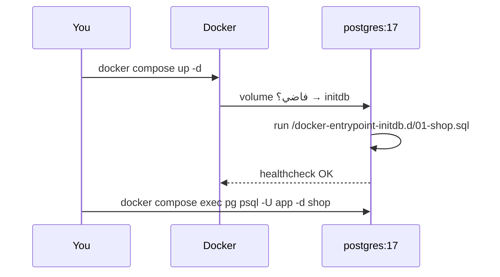

# Docker Setup

> Postgres 17 بـ container واحد + dataset جاهز، بدون تثبيت أي شي على جهازك.



## Example

```bash
cp .env.example .env
docker compose up -d
docker compose logs -f pg            # استنى "database system is ready"
docker compose exec pg psql -U app -d shop -c "SELECT count(*) FROM orders;"
#   count
# ---------
#  1000000
```

GUI اختياري:
```bash
docker compose --profile gui up -d   # http://localhost:5050
# Add server → host: pg · user: app · password من .env
```

## Commands

| الهدف | Command |
|---|---|
| Stop | `docker compose stop` |
| Start | `docker compose start` |
| Reset data | `docker compose down -v && docker compose up -d` |
| Shell | `docker compose exec pg bash` |

## Key Points
- init scripts تشتغل **أول مرة فقط**
- data بالـ volume `pg_data`
- البورت على `127.0.0.1` فقط

## Pitfall
❌ عدّلت `shop.sql` وما تغيّر شي → ✅ `docker compose down -v` (الـ volume قديم)

❌ `port is already allocated` → ✅ `PG_PORT=15432` بالـ `.env`

❌ Git Bash: `psql -f /repo/x.sql` → `No such file` → ✅ `export MSYS_NO_PATHCONV=1`

Next → [02-psql-cheatsheet](02-psql-cheatsheet.md)
