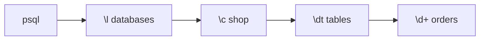

# psql Cheatsheet

> `psql` = الـ CLI الرسمي. الأوامر اللي بتبلّش بـ `\` هي meta-commands مش SQL.



## Meta-commands

| Command | شو بيعمل |
|---|---|
| `\l` | list databases |
| `\c shop` | connect to db |
| `\dt` | list tables |
| `\d+ orders` | columns + indexes + size |
| `\di` | list indexes |
| `\df` | list functions |
| `\dx` | installed extensions |
| `\x auto` | عرض عمودي للصفوف العريضة |
| `\timing on` | وقت كل query |
| `\i file.sql` | شغّل ملف |
| `\e` | افتح آخر query بـ editor |
| `\q` | exit |

## Example

```sql
\timing on
\d orders
--   Column   |           Type           | Nullable
-- -----------+--------------------------+----------
--  id        | bigint                   | not null
--  user_id   | bigint                   | not null
--  ...
SELECT count(*) FROM users;
-- Time: 4.812 ms
```

## Key Points
- `\?` = كل الـ meta-commands
- `\h CREATE INDEX` = syntax help
- `;` لازم بنهاية كل SQL

Next → [01-sql-basics/01-select-where](../../01-sql-basics/docs/01-select-where.md)
