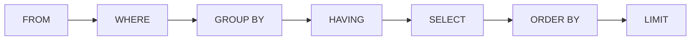

# SELECT & WHERE

> SQL بتنكتب بترتيب، وبتتنفذ بترتيب ثاني — افهم الترتيب المنطقي وبتفهم كل الأخطاء.



## Example

```sql
-- أغلى 5 منتجات electronics تحت 100
SELECT id, name, price
FROM products
WHERE category = 'electronics'
  AND price < 100
ORDER BY price DESC
LIMIT 5;

-- Operators
SELECT * FROM users WHERE country IN ('JO', 'PS');
SELECT * FROM users WHERE email LIKE 'user1%@shop.test';
SELECT * FROM products WHERE price BETWEEN 10 AND 20;
SELECT * FROM orders WHERE created_at >= now() - interval '7 days';
```

## NULL

| Expression | Result |
|---|---|
| `NULL = NULL` | `NULL` (مش true!) |
| `NULL IS NULL` | `true` |
| `COALESCE(NULL, 0)` | `0` |

## Key Points
- `WHERE` قبل `SELECT` → ما بتشوف aliases
- `ORDER BY` بعد `SELECT` → بتشوفها
- `LIMIT` بدون `ORDER BY` = ترتيب عشوائي

## Pitfall
❌ `SELECT price * 2 AS p FROM products WHERE p > 100;`
✅ `SELECT price * 2 AS p FROM products WHERE price * 2 > 100;`

Next → [02-crud](02-crud.md)
