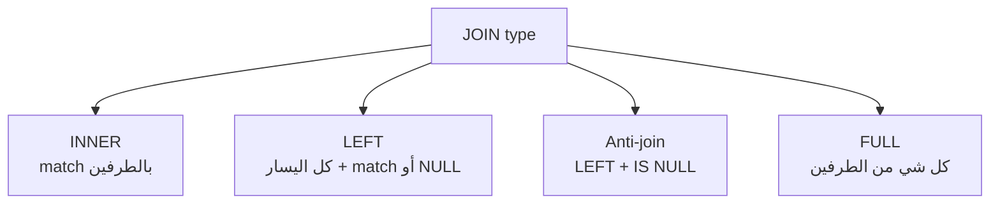

# JOINs

> ربط جداول عن طريق key مشترك.



## Example

```sql
-- INNER: كل order مع اسم المنتج
SELECT o.id, p.name, o.qty
FROM orders o
JOIN products p ON p.id = o.product_id
LIMIT 5;

-- LEFT: كل user مع عدد طلباته (0 إذا ما طلب)
SELECT u.id, count(o.id) AS orders
FROM users u
LEFT JOIN orders o ON o.user_id = u.id
GROUP BY u.id
ORDER BY orders
LIMIT 5;

-- Anti-join: users ما طلبوا ولا مرة
SELECT u.id, u.email
FROM users u
WHERE NOT EXISTS (SELECT 1 FROM orders o WHERE o.user_id = u.id);
```

## Numbers

| Join | Rows (shop) |
|---|---|
| `orders JOIN products` | 1,000,000 |
| `users LEFT JOIN orders` | ~1,000,005 (users بدون orders يظهروا مرة) |

## Key Points
- دايماً aliases قصيرة (`o`, `p`)
- `NOT EXISTS` أأمن من `NOT IN`
- `count(o.id)` مش `count(*)` مع LEFT

## Pitfall
❌ `WHERE id NOT IN (SELECT user_id ...)` → إذا فيه NULL واحد = صفر نتائج
✅ `NOT EXISTS (...)`

Next → [04-group-by](04-group-by.md)
