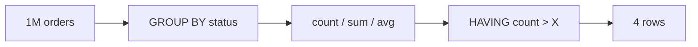

# GROUP BY & Aggregates

> اجمع صفوف كثيرة بصف واحد لكل group.



## Example

```sql
-- عدد وإيراد كل status
SELECT o.status,
       count(*)                     AS orders,
       sum(o.qty * p.price)         AS revenue
FROM orders o
JOIN products p ON p.id = o.product_id
GROUP BY o.status
ORDER BY revenue DESC;

-- دول فيها أكثر من 16,000 user
SELECT country, count(*)
FROM users
GROUP BY country
HAVING count(*) > 16000;

-- FILTER: عدة counts بـ scan واحد
SELECT count(*) FILTER (WHERE status = 'paid')      AS paid,
       count(*) FILTER (WHERE status = 'cancelled') AS cancelled
FROM orders;
```

## WHERE vs HAVING

| | يفلتر | قبل/بعد التجميع |
|---|---|---|
| `WHERE` | rows | قبل |
| `HAVING` | groups | بعد |

## Key Points
- كل عمود بـ SELECT: بالـ GROUP BY أو aggregate
- `FILTER` أنظف من `CASE`
- فلتر بـ `WHERE` قدر الإمكان (أسرع)

## Pitfall
❌ `SELECT country, name, count(*) FROM users GROUP BY country;`
✅ شيل `name` أو حطه بـ `GROUP BY`

Next → [02-data-modeling/01-data-types](../../02-data-modeling/docs/01-data-types.md)
