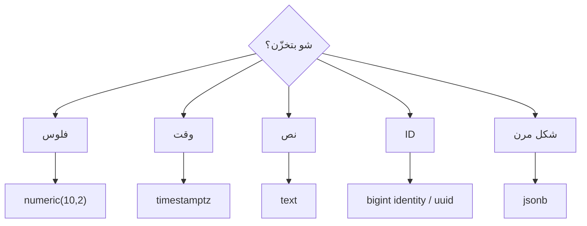

# Data Types

> النوع الصح = بيانات صح + مساحة أقل + indexes أسرع.



## Cheatsheet

| Use | ✅ Type | ❌ Avoid |
|---|---|---|
| Money | `numeric(10,2)` | `float`, `real` |
| Time | `timestamptz` | `timestamp` (بدون zone) |
| String | `text` (+ `CHECK` للطول) | `varchar(255)` عادةً |
| PK | `bigint GENERATED ALWAYS AS IDENTITY` | `serial` (قديم) |
| Public ID | `uuid` (`gen_random_uuid()`) | IDs متسلسلة مكشوفة |
| Flags | `boolean` | `int` 0/1 |
| Semi-structured | `jsonb` | `json` (بطيء للـ query) |

## Example

```sql
SELECT 0.1::float + 0.2::float;      -- 0.30000000000000004 ❌
SELECT 0.1::numeric + 0.2::numeric;  -- 0.3 ✅

SELECT '2026-01-01 10:00'::timestamptz AT TIME ZONE 'Asia/Amman';

SELECT pg_column_size(1::int), pg_column_size(1::bigint), pg_column_size(gen_random_uuid());
--  4 | 8 | 16   (bytes)
```

## Numbers — PK size on 1M rows

| PK | Index size |
|---|---|
| `int` | ~21 MB |
| `bigint` | ~21 MB (alignment) |
| `uuid` | ~30 MB |

## Key Points
- `timestamptz` يخزّن UTC دايماً
- `text` و `varchar` نفس الأداء
- `int` بيخلص عند 2.1 مليار

## Pitfall
❌ `price float` → أخطاء تقريب بالفواتير
✅ `price numeric(10,2)`

Next → [02-constraints](02-constraints.md)
