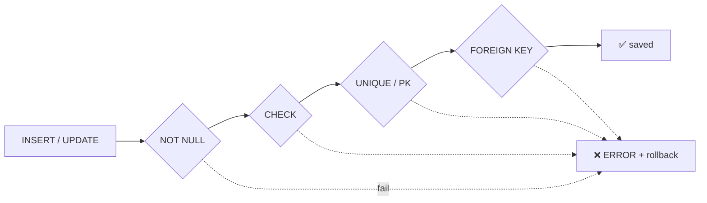

# Constraints

> القواعد جوا الـ DB = آخر خط دفاع ضد bugs الـ app.



## Example

```sql
CREATE TABLE reviews (
    id          bigint GENERATED ALWAYS AS IDENTITY PRIMARY KEY,
    user_id     bigint NOT NULL REFERENCES users(id) ON DELETE CASCADE,
    product_id  bigint NOT NULL REFERENCES products(id) ON DELETE RESTRICT,
    rating      int    NOT NULL CHECK (rating BETWEEN 1 AND 5),
    body        text   CHECK (length(body) <= 2000),
    UNIQUE (user_id, product_id)          -- review واحد لكل user/product
);

INSERT INTO reviews (user_id, product_id, rating) VALUES (1, 1, 9);
-- ERROR: new row violates check constraint "reviews_rating_check"  (SQLSTATE 23514)
```

## Error Codes

| SQLSTATE | Constraint |
|---|---|
| `23502` | NOT NULL |
| `23503` | FOREIGN KEY |
| `23505` | UNIQUE / PK |
| `23514` | CHECK |

## ON DELETE

| Option | لما ينحذف الـ parent |
|---|---|
| `RESTRICT` / `NO ACTION` | ممنوع |
| `CASCADE` | احذف الأولاد |
| `SET NULL` | الأولاد → NULL |

## Key Points
- الـ app يلقط `23505` → "email مستخدم"
- FK column **ما إلها index تلقائي**
- `CHECK` رخيص جداً

## Pitfall
❌ FK بدون index → `DELETE FROM users` يعمل seq scan على orders لكل صف
✅ `CREATE INDEX ON orders(user_id);`

Next → [03-normalization](03-normalization.md)
