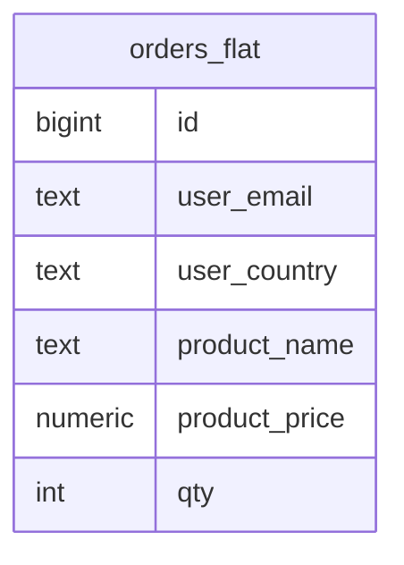
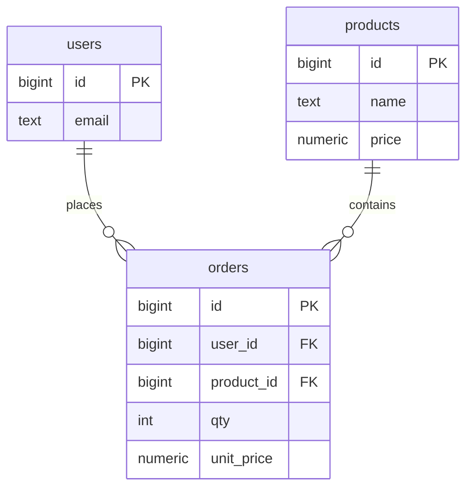

# Normalization

> كل معلومة تنخزن مرة وحدة → لا تناقض لما تعدّل.

## Before — جدول واحد



| id | user_email | product_name | product_price |
|---|---|---|---|
| 1 | a@x.io | Keyboard | 49.90 |
| 2 | a@x.io | Keyboard | **45.00** ← تناقض |

## After — 3NF



## Rules

| Form | Rule | مثال مخالفة |
|---|---|---|
| 1NF | قيمة atomic بكل خلية | `tags = 'a,b,c'` |
| 2NF | كل عمود يعتمد على **كل** الـ PK | `product_name` بجدول `(order_id, product_id)` |
| 3NF | ما في عمود يعتمد على عمود غير key | `country_name` جنب `country_code` |

## Example — فصل many-to-many

```sql
-- ❌ products.tags = 'sale,new'
CREATE TABLE tags (id int PRIMARY KEY, name text UNIQUE);
CREATE TABLE product_tags (
    product_id bigint REFERENCES products(id),
    tag_id     int    REFERENCES tags(id),
    PRIMARY KEY (product_id, tag_id)
);
```

## Key Points
- Normalize أولاً، denormalize بقياس
- `unit_price` بالـ order = snapshot تاريخي (مش تكرار)
- Reports ثقيلة → materialized view ([08](../../08-ecosystem/docs/02-views-matviews.md))

Next → [03-advanced-sql/01-cte](../../03-advanced-sql/docs/01-cte.md)
