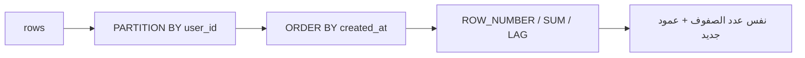

# Window Functions

> حسابات عبر صفوف مرتبطة **بدون** ما تدمجها (عكس GROUP BY).



## Example — Top-N لكل group

```sql
-- أغلى 3 منتجات بكل category
SELECT category, name, price
FROM (
    SELECT category, name, price,
           row_number() OVER (PARTITION BY category ORDER BY price DESC) AS rn
    FROM products
) x
WHERE rn <= 3;
```

## Running total + LAG

```sql
WITH daily AS (
    SELECT created_at::date AS day, count(*) AS orders
    FROM orders GROUP BY 1
)
SELECT day, orders,
       sum(orders) OVER (ORDER BY day)                          AS running_total,
       orders - lag(orders) OVER (ORDER BY day)                 AS diff_vs_yesterday,
       round(avg(orders) OVER (ORDER BY day ROWS 6 PRECEDING))  AS avg_7d
FROM daily
ORDER BY day DESC LIMIT 5;
```

## Functions

| Function | Output |
|---|---|
| `row_number()` | 1,2,3,4 |
| `rank()` | 1,2,2,4 |
| `dense_rank()` | 1,2,2,3 |
| `lag(x)` / `lead(x)` | القيمة السابقة / التالية |
| `sum(x) OVER (...)` | running total |
| `ntile(4)` | quartiles |

## Key Points
- `PARTITION BY` = groups بدون دمج
- Top-N per group = `row_number()`
- Frame: `ROWS n PRECEDING` = moving avg

## Pitfall
❌ `WHERE row_number() OVER (...) <= 3` → window بعد WHERE
✅ subquery / CTE ثم `WHERE rn <= 3`

Next → [03-jsonb](03-jsonb.md)
