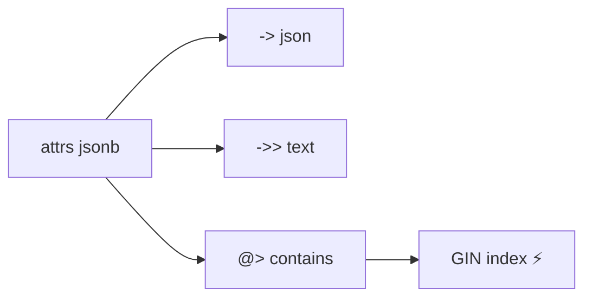

# JSONB

> Schema مرن جوا جدول relational — مع indexes.



## Example

```sql
SELECT id, attrs FROM products LIMIT 2;
--  1 | {"color": "black", "rating": 2}

SELECT attrs -> 'color'  AS as_json,     -- "black"
       attrs ->> 'color' AS as_text,     -- black
       (attrs ->> 'rating')::int AS rating
FROM products LIMIT 1;

-- Filter
SELECT count(*) FROM products WHERE attrs @> '{"color": "red"}';

-- Update key
UPDATE products SET attrs = attrs || '{"on_sale": true}' WHERE id = 1;
UPDATE products SET attrs = jsonb_set(attrs, '{rating}', '5') WHERE id = 1;
UPDATE products SET attrs = attrs - 'on_sale' WHERE id = 1;
```

## Index

```sql
CREATE INDEX products_attrs_gin ON products USING gin (attrs);
EXPLAIN SELECT * FROM products WHERE attrs @> '{"color": "red"}';
-- Bitmap Index Scan on products_attrs_gin
```

## Operators

| Op | Meaning |
|---|---|
| `->` / `->>` | key → json / text |
| `#>>'{a,b}'` | nested path |
| `@>` | contains (يستخدم GIN) |
| `?` | key exists |
| `\|\|` | merge |
| `-` | remove key |

## Key Points
- `jsonb` مش `json`
- GIN يدعم `@>` مش `->> =`
- Fields ثابتة → أعمدة عادية

## Pitfall
❌ `WHERE attrs->>'color' = 'red'` (ما بيستخدم GIN)
✅ `WHERE attrs @> '{"color":"red"}'`

Next → [04-upsert](04-upsert.md)
