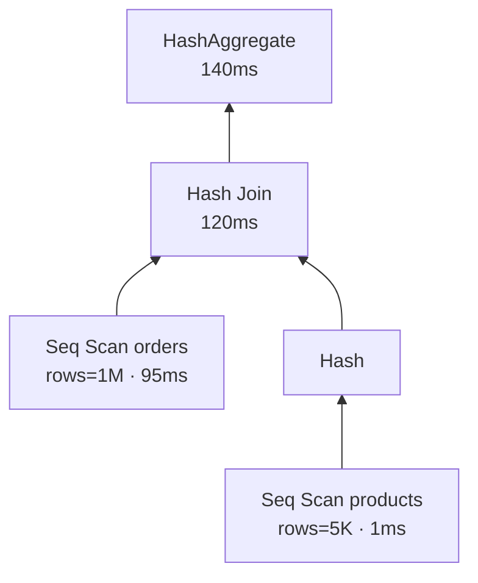

# EXPLAIN ANALYZE

> الـ planner بيختار plan؛ `EXPLAIN ANALYZE` بيشغّله فعلياً وبيوريك الوقت الحقيقي لكل خطوة.


اقرأ الـ plan **من تحت لفوق**، ومن جوّا لبرّا.

## Example

```sql
EXPLAIN (ANALYZE, BUFFERS)
SELECT * FROM orders WHERE user_id = 42;
```
```text
Gather  (cost=1000.00..15555.43 rows=11 width=43) (actual time=108.9..631.5 rows=12 loops=1)
  Workers Planned: 2
  ->  Parallel Seq Scan on orders  (actual time=108.9..493.7 rows=4 loops=3)
        Filter: (user_id = 42)
        Rows Removed by Filter: 333329
        Buffers: shared hit=529 read=8817
Planning Time: 0.2 ms
Execution Time: 631.7 ms
```
(مقاس على Docker Desktop · cold cache. `read=8817` = pages من الـ disk)

## اقرأ الأرقام

| Field | معناه |
|---|---|
| `cost=a..b` | تقدير (وحدات planner، مش ms) |
| `actual time=a..b` | ms فعلي (أول صف..آخر صف) |
| `rows` تقدير vs actual | فرق كبير = stats قديمة |
| `loops` | اضرب الوقت فيها |
| `Rows Removed by Filter` | شغل ضايع → index؟ |
| `shared hit / read` | من RAM / من disk |

## Node Types

| Node | متى |
|---|---|
| Seq Scan | كل الجدول |
| Index Scan | index + heap |
| Index Only Scan | index فقط ⚡ |
| Bitmap Heap Scan | صفوف كثيرة متفرقة |
| Nested Loop / Hash / Merge Join | أنواع join |

## Pitfall
❌ `EXPLAIN ANALYZE DELETE ...` → **بيحذف فعلاً**
✅ `BEGIN; EXPLAIN ANALYZE DELETE ...; ROLLBACK;`

Next → [02-btree](02-btree.md)
