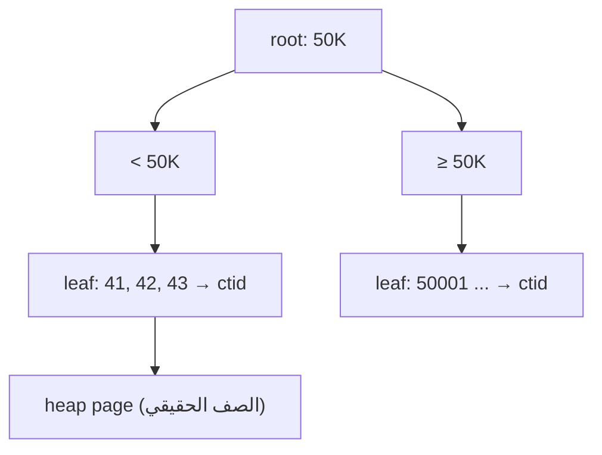

# B-Tree Index

> Default index. شجرة مرتبة → `=`, `<`, `>`, `BETWEEN`, `ORDER BY` بـ O(log n).



## Before → After

```sql
EXPLAIN ANALYZE SELECT * FROM orders WHERE user_id = 42;
-- Parallel Seq Scan · Execution Time: 631 ms

CREATE INDEX orders_user_id_idx ON orders (user_id);

EXPLAIN ANALYZE SELECT * FROM orders WHERE user_id = 42;
-- Bitmap Heap Scan → Bitmap Index Scan on orders_user_id_idx · Execution Time: 0.36 ms
```

| | Time | Buffers |
|---|---|---|
| Seq Scan | ~340–630 ms | 9,346 pages |
| Index | ~0.36 ms | 18 pages |
| | **~1,750× أسرع** | |

(مقاس على Docker Desktop 4 CPU؛ VPS بـ NVMe أسرع للـ seq scan بس النسبة قريبة)

## Composite — ترتيب الأعمدة مهم

```sql
CREATE INDEX orders_user_created_idx ON orders (user_id, created_at DESC);
```

| Query | يستخدم الـ index؟ |
|---|---|
| `WHERE user_id = 42` | ✅ |
| `WHERE user_id = 42 ORDER BY created_at DESC` | ✅ بدون sort |
| `WHERE created_at > now() - '1 day'` | ❌ (مش أول عمود) |

قاعدة: **equality أولاً، range/sort آخراً**.

## Cost

```sql
SELECT pg_size_pretty(pg_relation_size('orders_user_id_idx'));  -- 9 MB (dedup: ~10 orders/user)
```
كل index = مساحة + بطء بكل `INSERT/UPDATE`.

## Pitfall
❌ `CREATE INDEX` على production → يقفل الـ writes
✅ `CREATE INDEX CONCURRENTLY ...`

Next → [03-index-types](03-index-types.md)
