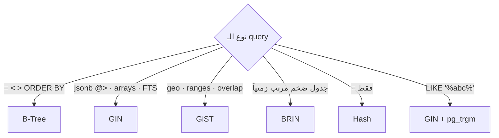

# Index Types

> كل نوع data/operator إله index مناسب.



## Examples

```sql
-- GIN: jsonb
CREATE INDEX ON products USING gin (attrs);
SELECT * FROM products WHERE attrs @> '{"color":"red"}';

-- BRIN: tiny index لجدول append-only
CREATE INDEX orders_created_brin ON orders USING brin (created_at);

-- Trigram: search بنص الكلمة
CREATE EXTENSION IF NOT EXISTS pg_trgm;
CREATE INDEX ON users USING gin (email gin_trgm_ops);
SELECT * FROM users WHERE email LIKE '%er4242%';

-- GiST: منع تداخل حجوزات
CREATE EXTENSION IF NOT EXISTS btree_gist;
CREATE TABLE bookings (
    room int,
    during tstzrange,
    EXCLUDE USING gist (room WITH =, during WITH &&)
);
```

## Numbers — `orders.created_at` (1M rows)

| Index | Size |
|---|---|
| B-Tree | ~21 MB |
| BRIN | ~24 KB |

⚠️ BRIN مفيد فقط إذا ترتيب الصفوف بالـ disk = ترتيب العمود (insert زمني). بالـ shop dataset الـ `created_at` عشوائي → BRIN ضعيف هون.

## Key Points
- 95% من الحالات: B-Tree
- GIN: قراءة سريعة، كتابة أبطأ
- BRIN: logs / events / time-series

Next → [04-partial-covering](04-partial-covering.md)
