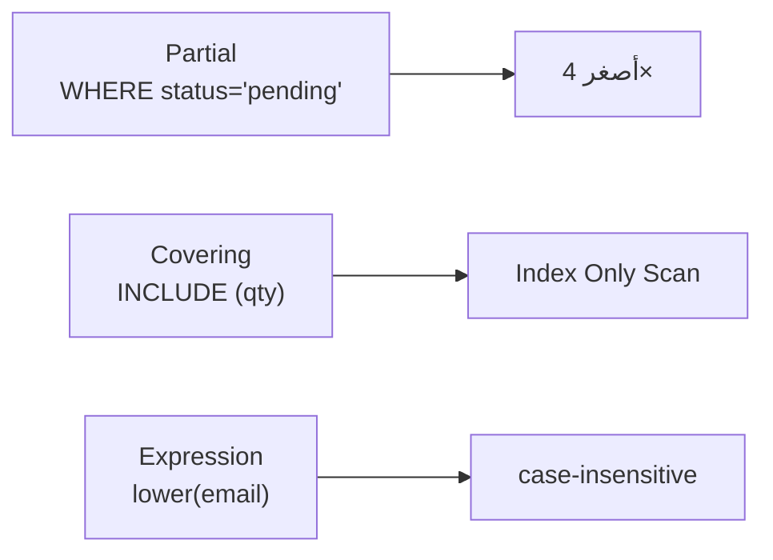

# Partial · Covering · Expression Indexes

> index أصغر وأذكى = أسرع وأقل كلفة.



## Partial

```sql
-- بس 25% من الطلبات pending
CREATE INDEX orders_pending_idx ON orders (created_at) WHERE status = 'pending';

SELECT * FROM orders
WHERE status = 'pending' AND created_at < now() - interval '1 day';
```

## Covering → Index Only Scan

```sql
CREATE INDEX orders_user_cov_idx ON orders (user_id) INCLUDE (qty, status);
VACUUM orders;       -- يحدّث visibility map

EXPLAIN SELECT qty, status FROM orders WHERE user_id = 42;
-- Index Only Scan using orders_user_cov_idx   Heap Fetches: 0
```

## Expression

```sql
CREATE INDEX users_email_lower_idx ON users (lower(email));
SELECT * FROM users WHERE lower(email) = 'user42@shop.test';   -- ✅ uses index
SELECT * FROM users WHERE email ILIKE 'user42@shop.test';      -- ❌ لا

-- expression index = stats جديدة → بدها ANALYZE
EXPLAIN ANALYZE SELECT * FROM users WHERE lower(email) = 'user42@shop.test';
-- قبل ANALYZE:  rows=500 (تخمين 0.5%)  actual rows=1
ANALYZE users;
-- بعد ANALYZE:  rows=1                 actual rows=1   ✅
```

## Numbers

| Index على orders | Size |
|---|---|
| `(created_at)` كامل | ~21 MB |
| `(created_at) WHERE status='pending'` | ~5.5 MB |

## Unused indexes

```sql
SELECT relname, indexrelname, idx_scan, pg_size_pretty(pg_relation_size(indexrelid))
FROM pg_stat_user_indexes
WHERE idx_scan = 0 ORDER BY pg_relation_size(indexrelid) DESC;
```

## Pitfall
❌ `WHERE created_at::date = '2026-01-01'` → ما بيستخدم index على `created_at`
✅ `WHERE created_at >= '2026-01-01' AND created_at < '2026-01-02'`

Next → [05-transactions-mvcc/01-acid](../../05-transactions-mvcc/docs/01-acid.md)
