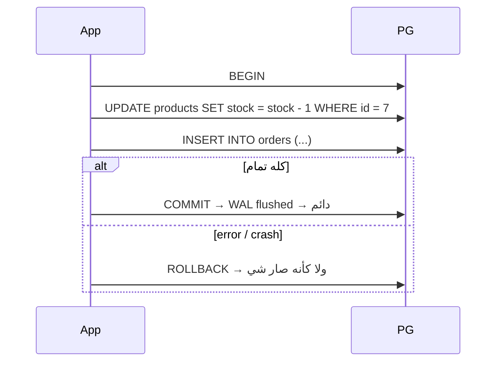

# ACID & Transactions

> مجموعة statements = وحدة وحدة: كلها تنجح أو ولا وحدة.



## ACID

| Letter | معناه | مين بيضمنه |
|---|---|---|
| **A**tomicity | الكل أو لا شي | transaction |
| **C**onsistency | constraints دايماً صحيحة | constraints |
| **I**solation | transactions ما بتخرب بعض | MVCC + locks |
| **D**urability | بعد COMMIT ما بيضيع | WAL |

## Example

```sql
BEGIN;
UPDATE products SET stock = stock - 1 WHERE id = 7;
INSERT INTO orders (user_id, product_id, qty) VALUES (1, 7, 1);
COMMIT;

-- SAVEPOINT: rollback جزئي
BEGIN;
INSERT INTO orders (user_id, product_id, qty) VALUES (1, 7, 1);
SAVEPOINT before_risky;
INSERT INTO orders (user_id, product_id, qty) VALUES (1, 7, -1);  -- ERROR 23514
ROLLBACK TO before_risky;
COMMIT;   -- أول insert محفوظ
```

## Key Points
- بدون `BEGIN` = كل statement transaction لحاله
- error جوا transaction → لازم ROLLBACK
- transactions قصيرة قدر الإمكان

## Pitfall
❌ `BEGIN` → استدعاء HTTP API (5s) → `COMMIT` = locks ماسكة 5s
✅ نادي الـ API برّا الـ transaction

Next → [02-isolation-levels](02-isolation-levels.md)
