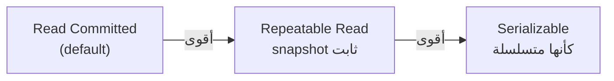

# Isolation Levels

> قديش transaction بتشوف تغييرات transactions ثانية شغالة بنفس الوقت.



## Anomalies

| Level | Dirty read | Non-repeatable read | Phantom | Lost update / write skew |
|---|---|---|---|---|
| Read Committed | ❌ | ✅ ممكن | ✅ ممكن | ✅ ممكن |
| Repeatable Read | ❌ | ❌ | ❌ (بـ PG) | write skew ممكن |
| Serializable | ❌ | ❌ | ❌ | ❌ |

## Demo — افتح 2 terminals

```sql
-- T1                                        -- T2
BEGIN ISOLATION LEVEL REPEATABLE READ;
SELECT stock FROM products WHERE id = 1;     -- 100000
                                             UPDATE products SET stock = 0 WHERE id = 1;
SELECT stock FROM products WHERE id = 1;     -- لسا 100000 (snapshot)
UPDATE products SET stock = stock - 1 WHERE id = 1;
-- ERROR: could not serialize access due to concurrent update
ROLLBACK;
```
نفس الـ demo بـ `READ COMMITTED` → الـ SELECT الثاني بيرجع `0`.

## Lost Update — Before → After

```sql
-- ❌ app: read ثم write (2 requests → واحد بيضيع)
SELECT stock FROM products WHERE id = 1;           -- 10
UPDATE products SET stock = 9 WHERE id = 1;

-- ✅ atomic
UPDATE products SET stock = stock - 1 WHERE id = 1 AND stock > 0;
```

## Key Points
- Default RC كافي لمعظم الحالات
- RR / Serializable → لازم **retry** على `40001`
- atomic `UPDATE` أبسط من رفع الـ level

Next → [03-mvcc](03-mvcc.md)
