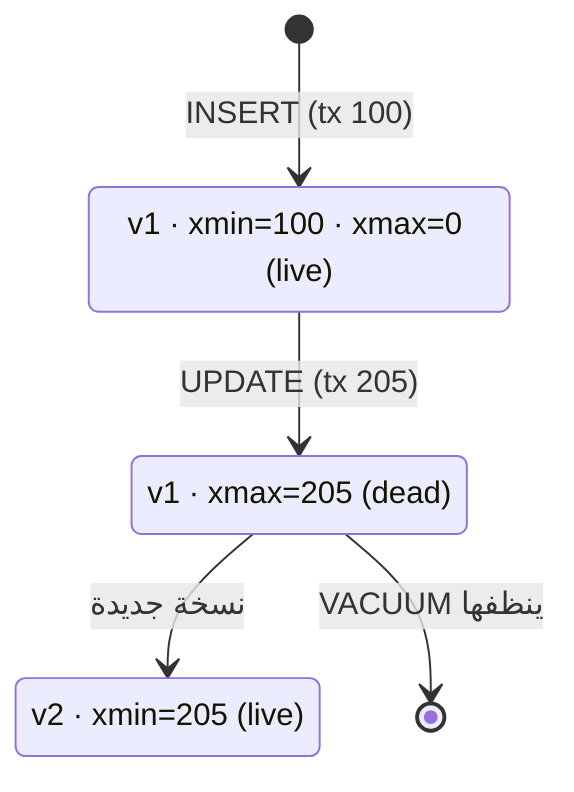

# MVCC — Multi-Version Concurrency Control

> `UPDATE` ما بيعدّل الصف؛ بينشئ **نسخة جديدة**. القرّاء ما بيستنوا الكتّاب أبداً.



## Example — شوف النسخ بعينك

```sql
CREATE TEMP TABLE t (id int, v text);
INSERT INTO t VALUES (1, 'a');
SELECT ctid, xmin, xmax, * FROM t;
--  ctid  | xmin | xmax | id | v
--  (0,1) | 812  |  0   |  1 | a

UPDATE t SET v = 'b' WHERE id = 1;
SELECT ctid, xmin, xmax, * FROM t;
--  (0,2) | 813  |  0   |  1 | b      ← مكان جديد (ctid تغيّر)
```

## Visibility Rule

| الصف visible لـ tx X إذا |
|---|
| `xmin` committed وقبل snapshot تبع X |
| و `xmax` = 0 أو مش committed أو بعد الـ snapshot |

## Numbers

```sql
UPDATE orders SET qty = qty WHERE id <= 100000;   -- 100K update
SELECT n_live_tup, n_dead_tup FROM pg_stat_user_tables WHERE relname = 'orders';
--  n_live_tup | n_dead_tup
--   1000000   |  100000      ← نسخ ميتة تنتظر VACUUM
```

## Key Points
- Readers ما بيقفلوا writers
- كل UPDATE = INSERT + mark dead
- Dead tuples → [VACUUM](../../06-internals/docs/03-vacuum.md)

## Pitfall
❌ transaction مفتوحة ساعات (`idle in transaction`) → VACUUM ما بيقدر ينظف → bloat
✅ `idle_in_transaction_session_timeout = '5min'`

Next → [04-locks-deadlocks](04-locks-deadlocks.md)
