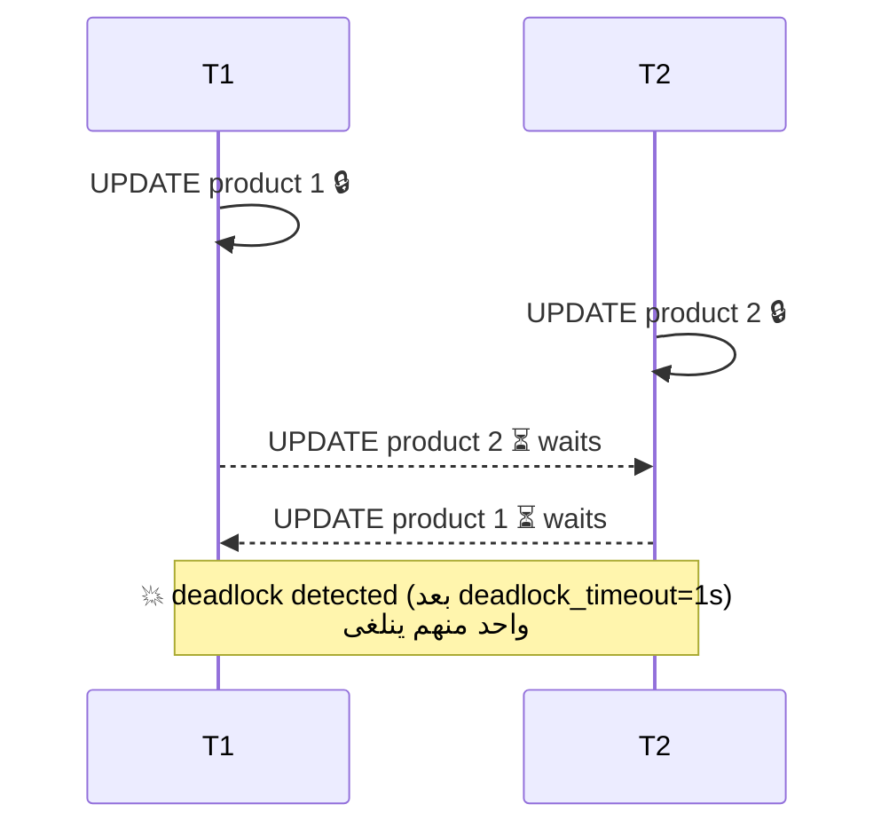

# Locks & Deadlocks

> Writers على **نفس الصف** بيستنوا بعض. ترتيب مختلف = deadlock.



## Fix — ترتيب ثابت

```sql
-- ✅ دايماً اقفل بترتيب id
BEGIN;
SELECT * FROM products WHERE id IN (1, 2) ORDER BY id FOR UPDATE;
UPDATE products SET stock = stock - 1 WHERE id IN (1, 2);
COMMIT;
```

## Row lock modes

| Clause | استخدام |
|---|---|
| `FOR UPDATE` | رح أعدّل الصف |
| `FOR NO KEY UPDATE` | أخف، ما بيمنع FK inserts |
| `FOR SHARE` | اقرأ وامنع التعديل |
| `NOWAIT` | error فوراً بدل الانتظار |
| `SKIP LOCKED` | تجاهل المقفول (queues) |

## Job Queue بـ SKIP LOCKED

```sql
-- 10 workers بياخدوا jobs مختلفة بدون تعارض
WITH job AS (
    SELECT id FROM orders
    WHERE status = 'pending'
    ORDER BY created_at
    LIMIT 1
    FOR UPDATE SKIP LOCKED
)
UPDATE orders SET status = 'paid' FROM job WHERE orders.id = job.id
RETURNING orders.id;
```

## مين قافل مين؟

```sql
SELECT pid, pg_blocking_pids(pid) AS blocked_by, wait_event_type, left(query, 60)
FROM pg_stat_activity
WHERE cardinality(pg_blocking_pids(pid)) > 0;
```

## Pitfall
❌ `ALTER TABLE orders ADD COLUMN ...` وقت الضغط → ينتظر lock ويقفل كل الـ queries وراه
✅ `SET lock_timeout = '3s';` قبل أي migration

Next → [06-internals/01-storage-pages](../../06-internals/docs/01-storage-pages.md)
