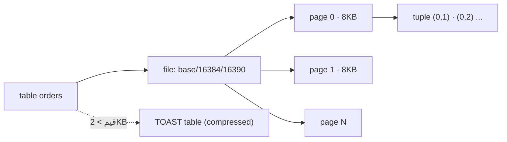

# Storage — Pages, Heap, TOAST

> كل جدول = ملف مقسوم لـ pages حجم كل وحدة 8 KB. الصفوف (tuples) جوا الـ pages.



## Example

```sql
SELECT pg_relation_filepath('orders');          -- base/16384/16390
SELECT current_setting('block_size');           -- 8192

SELECT relpages, reltuples::bigint,
       round(reltuples / relpages) AS rows_per_page
FROM pg_class WHERE relname = 'orders';
--  relpages | reltuples | rows_per_page
--    9346   |  1000000  |     107

SELECT ctid, id FROM orders LIMIT 3;            -- (0,1) (0,2) (0,3) = (page, slot)
```

## Sizes

```sql
SELECT pg_size_pretty(pg_relation_size('orders'))        AS heap,
       pg_size_pretty(pg_indexes_size('orders'))         AS indexes,
       pg_size_pretty(pg_total_relation_size('orders'))  AS total;
```

| Function | يشمل |
|---|---|
| `pg_relation_size` | heap فقط |
| `pg_indexes_size` | كل الـ indexes |
| `pg_total_relation_size` | heap + indexes + TOAST |

## Key Points
- I/O دايماً بوحدة page (8KB)
- `ctid` = عنوان فيزيائي، بيتغيّر مع UPDATE
- TOAST تلقائي للقيم الكبيرة

## Pitfall
❌ `SELECT *` على جدول فيه `jsonb` ضخم → يقرأ TOAST بلا داعي
✅ اختار الأعمدة اللي بتحتاجها

Next → [02-wal](02-wal.md)
