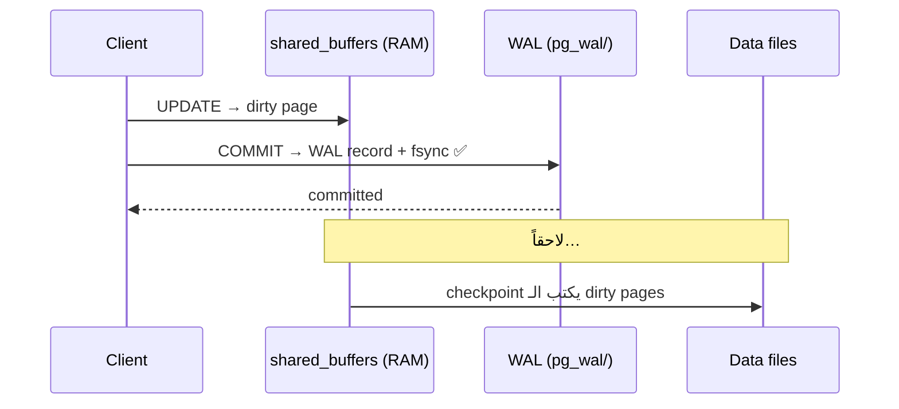

# WAL — Write-Ahead Log

> التغيير بينكتب بالـ log **أول**؛ الـ data files بتتحدّث لاحقاً. crash؟ replay الـ WAL.



## ليش؟

| بدون WAL | مع WAL |
|---|---|
| كل COMMIT = random writes لكل page | sequential append واحد |
| crash = data files نص مكتوبة | replay من آخر checkpoint |
| — | أساس الـ **replication** و **PITR** |

## Example

```sql
SELECT pg_current_wal_lsn() AS before \gset             -- psql: خزّن بـ :before
UPDATE orders SET qty = qty WHERE id <= 10000;
SELECT pg_size_pretty(pg_wal_lsn_diff(pg_current_wal_lsn(), :'before'));
-- 6430 kB  (مقاس بعد lab 04: 10K update ≈ 640 bytes WAL/row — كل index بيزيد WAL)
```

## Settings

| Setting | Default | أثره |
|---|---|---|
| `wal_level` | replica | `logical` للـ logical replication |
| `max_wal_size` | 1GB | أكبر = checkpoints أقل |
| `checkpoint_timeout` | 5min | |
| `synchronous_commit` | on | `off` = أسرع، ممكن تخسر آخر ~600ms |

## Key Points
- COMMIT دائم = WAL على disk
- Replica = يستقبل WAL ([11](../../11-replication/docs/01-streaming-replication.md))
- Checkpoint كثير = I/O spikes

## Pitfall
❌ `fsync = off` بالـ production → corruption بعد power loss
✅ `synchronous_commit = off` إذا بدك سرعة (آمن من corruption)

Next → [03-vacuum](03-vacuum.md)
