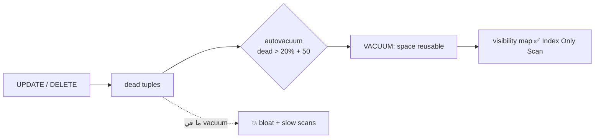

# VACUUM & Bloat

> MVCC بيخلّف dead tuples. VACUUM بيعلّم مكانهم قابل لإعادة الاستخدام.



## Bloat Experiment

```sql
-- على نسخة بدون indexes (كل index = كتابة إضافية لكل صف)
CREATE TABLE orders_bloat AS SELECT * FROM orders;
SELECT pg_size_pretty(pg_relation_size('orders_bloat'));   -- 73 MB

UPDATE orders_bloat SET qty = qty;                          -- 1M new versions
SELECT pg_size_pretty(pg_relation_size('orders_bloat'));   -- 147 MB 😱

VACUUM orders_bloat;
SELECT pg_size_pretty(pg_relation_size('orders_bloat'));   -- لسا 147 MB (بس المساحة reusable)

VACUUM FULL orders_bloat;                                   -- ⚠️ يقفل الجدول كامل
SELECT pg_size_pretty(pg_relation_size('orders_bloat'));   -- 73 MB
```
(أرقام مقاسة فعلياً — [lab.sql](../lab.sql))

## Types

| Command | Lock | يرجّع المساحة للـ OS |
|---|---|---|
| `VACUUM` | خفيف (reads/writes شغالة) | ❌ |
| `VACUUM ANALYZE` | خفيف + stats | ❌ |
| `VACUUM FULL` | **exclusive** | ✅ |
| `pg_repack` (extension) | خفيف | ✅ |

## Monitor

```sql
SELECT relname, n_dead_tup, last_autovacuum, last_autoanalyze
FROM pg_stat_user_tables ORDER BY n_dead_tup DESC LIMIT 5;
```

## Tune للجداول الكبيرة

```sql
-- default 20% من 100M = 20M dead قبل ما يشتغل!
ALTER TABLE orders SET (autovacuum_vacuum_scale_factor = 0.02);
```

## Pitfall
❌ تعطيل autovacuum "لأنه بياكل CPU" → bloat + **transaction ID wraparound** (الـ DB بتوقف)
✅ خليه شغال واعمله tune

Next → [04-planner-stats](04-planner-stats.md)
