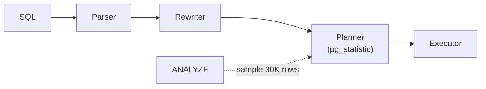

# Query Planner & Statistics

> الـ planner بيقدّر عدد الصفوف من الـ stats، وبيختار أرخص plan. stats غلط = plan غلط.



## Example — شو بيعرف الـ planner؟

```sql
SELECT attname, n_distinct, most_common_vals, most_common_freqs
FROM pg_stats WHERE tablename = 'orders' AND attname = 'status';
--  status | 4 | {paid,shipped,pending,cancelled} | {0.25,0.25,0.25,0.25}
```

## Estimate vs Actual

```sql
EXPLAIN ANALYZE SELECT * FROM orders WHERE status = 'paid';
-- Seq Scan ... (rows=250000) (actual rows=250112)   ✅ قريب
```

| الحالة | نتيجة |
|---|---|
| estimate ≈ actual | plan منطقي |
| estimate 10 / actual 100K | Nested Loop كارثي 💥 |

## Fixes

```sql
ANALYZE orders;                                           -- حدّث stats

ALTER TABLE orders ALTER COLUMN user_id SET STATISTICS 1000;  -- sample أكبر
ANALYZE orders;

-- أعمدة مترابطة (city + country)
CREATE STATISTICS orders_user_product (dependencies, ndistinct)
    ON user_id, product_id FROM orders;
ANALYZE orders;
```

## Planner cost settings

| Setting | Default | SSD |
|---|---|---|
| `random_page_cost` | 4.0 | 1.1 |
| `effective_cache_size` | 4GB | ~75% RAM |

## Key Points
- بعد bulk load: `ANALYZE` فوراً
- Seq Scan مش دايماً غلط (صفوف كثيرة)
- فرق كبير بالـ rows = أول شي تفحصه

Next → [07-ops-scaling/01-roles-rls](../../07-ops-scaling/docs/01-roles-rls.md)
