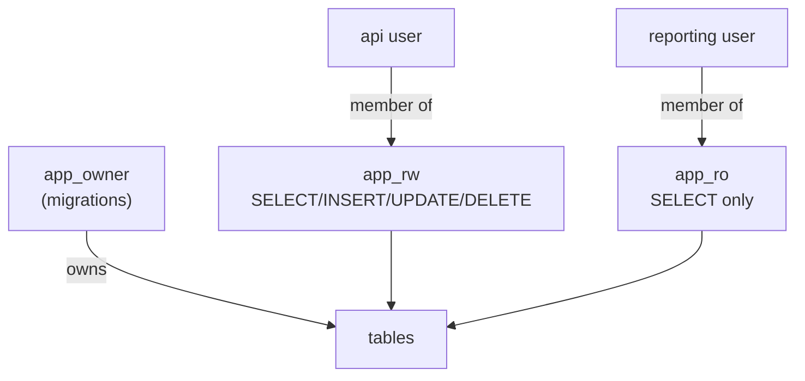
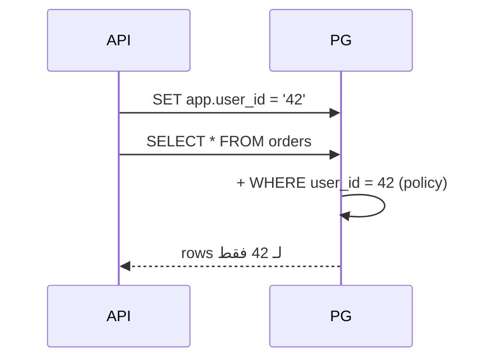

# Roles & Row-Level Security

> Least privilege: كل app/user بياخد بس اللي بيحتاجه. RLS = فلتر إجباري على مستوى الصف.



## Roles

```sql
CREATE ROLE app_ro NOLOGIN;
GRANT CONNECT ON DATABASE shop TO app_ro;
GRANT USAGE ON SCHEMA public TO app_ro;
GRANT SELECT ON ALL TABLES IN SCHEMA public TO app_ro;
ALTER DEFAULT PRIVILEGES IN SCHEMA public GRANT SELECT ON TABLES TO app_ro;  -- جداول مستقبلية

CREATE ROLE reporting LOGIN PASSWORD 'change_me' IN ROLE app_ro;
-- reporting: SELECT ✅  ·  DELETE ❌ permission denied
```

## RLS — كل tenant بيشوف بياناته بس

```sql
ALTER TABLE orders ENABLE ROW LEVEL SECURITY;

CREATE POLICY orders_owner ON orders
    USING (user_id = current_setting('app.user_id')::bigint);

-- من الـ app بكل request:
SET app.user_id = '42';
SELECT count(*) FROM orders;      -- بس طلبات user 42
```



## Key Points
- ما تستخدم superuser بالـ app
- Group roles (`NOLOGIN`) + members
- Superuser بيتجاوز RLS **دايماً**؛ الـ owner كمان إلا مع `FORCE ROW LEVEL SECURITY`
- `app` بهالـ repo = superuser → اختبر RLS بـ `SET ROLE` (زي الـ lab)

## Pitfall
❌ `GRANT ALL ON ALL TABLES TO api;`
✅ `GRANT SELECT, INSERT, UPDATE ON orders TO api;`

Next → [02-backup-restore](02-backup-restore.md)
