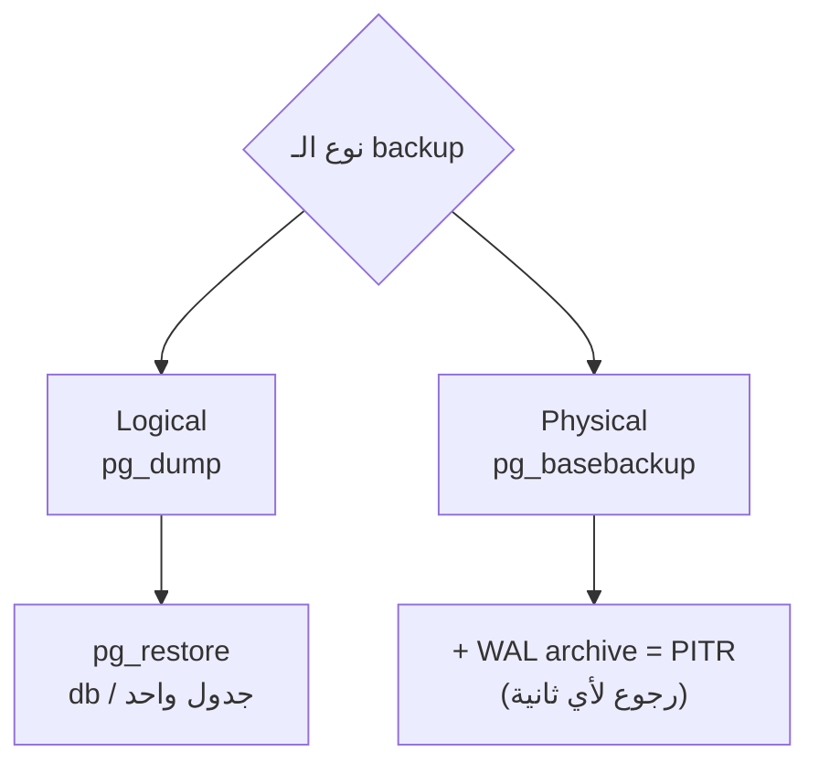

# Backup & Restore

> Replica مش backup. `DROP TABLE` بينتقل للـ replica خلال ms.



## Logical — pg_dump

```bash
# dump (custom format = مضغوط + restore انتقائي)
docker compose exec -T pg pg_dump -U app -Fc shop > shop.dump

# restore لـ DB جديدة
docker compose exec pg createdb -U app shop_restore
docker compose exec -T pg pg_restore -U app -d shop_restore --no-owner < shop.dump

# جدول واحد
docker compose exec -T pg pg_restore -U app -d shop -t products --clean < shop.dump
```

## Physical — pg_basebackup

```bash
docker compose exec pg pg_basebackup -U app -D /tmp/base -Ft -z -Xs -P
```

## Compare

| | pg_dump | pg_basebackup + WAL |
|---|---|---|
| Granularity | DB / table | cluster كامل |
| Restore لنقطة زمنية | ❌ | ✅ PITR |
| Cross-version | ✅ | ❌ نفس major |
| سرعة 100 GB | بطيء (ساعات) | أسرع |
| أدوات | cron | pgBackRest / WAL-G / Barman |

## Numbers — shop DB

| Format | Size |
|---|---|
| Plain SQL | ~80 MB |
| `-Fc` custom | ~20 MB |

## Key Points
- 3-2-1: 3 نسخ، 2 media، 1 offsite
- **جرّب الـ restore** دورياً
- Production: pgBackRest أو WAL-G

## Pitfall
❌ backup على نفس الـ VPS فقط → disk مات = كل شي راح
✅ upload لـ S3 / Backblaze ([10 cron](../../10-vps-deploy/docs/03-backups-cron.md))

Next → [03-partitioning](03-partitioning.md)
