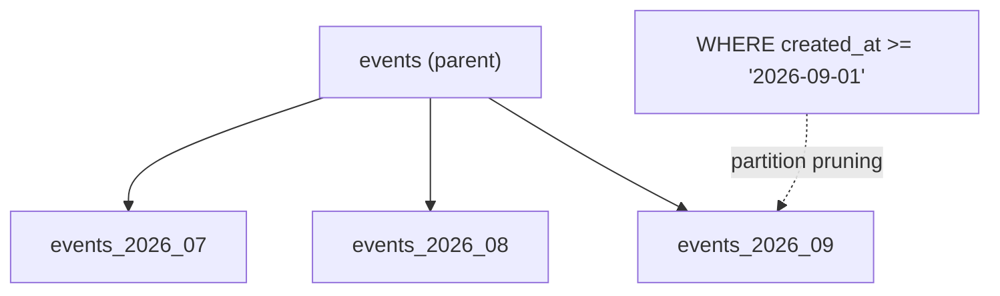

# Partitioning

> جدول ضخم → جداول أصغر حسب مفتاح (عادةً التاريخ). Queries بتقرأ الـ partitions اللازمة بس.



## Example — Range by month

```sql
CREATE TABLE events (
    id          bigint GENERATED ALWAYS AS IDENTITY,
    user_id     bigint NOT NULL,
    type        text   NOT NULL,
    created_at  timestamptz NOT NULL,
    PRIMARY KEY (id, created_at)            -- لازم يشمل partition key
) PARTITION BY RANGE (created_at);

CREATE TABLE events_2026_08 PARTITION OF events
    FOR VALUES FROM ('2026-08-01') TO ('2026-09-01');
CREATE TABLE events_2026_09 PARTITION OF events
    FOR VALUES FROM ('2026-09-01') TO ('2026-10-01');
CREATE TABLE events_default PARTITION OF events DEFAULT;

EXPLAIN SELECT * FROM events WHERE created_at >= '2026-09-10';
-- Append
--   -> Seq Scan on events_2026_09     ← 08 انشالت (pruned)
--   -> Seq Scan on events_default     ← DEFAULT بيغطي ≥ 2026-10-01 فلازم ينقرأ

EXPLAIN SELECT * FROM events
WHERE created_at >= '2026-09-10' AND created_at < '2026-10-01';
-- Seq Scan on events_2026_09        ← partition وحدة بس
```

## Drop old data — Before → After

| Method | 50M rows |
|---|---|
| `DELETE FROM events WHERE created_at < ...` | دقائق + bloat + WAL ضخم |
| `DROP TABLE events_2025_01` | ~ms، صفر bloat |

## Types

| Type | مثال |
|---|---|
| RANGE | تاريخ |
| LIST | country / tenant |
| HASH | توزيع متساوي بـ user_id |

## Key Points
- مفيد فوق ~50-100M row
- Query لازم يفلتر بالـ partition key
- أتمتة إنشاء partitions: `pg_partman`

## Pitfall
❌ Partition لجدول 1M row → overhead بلا فايدة
✅ Index جيد أولاً، partition لما يكبر

Next → [04-pgbouncer](04-pgbouncer.md)
