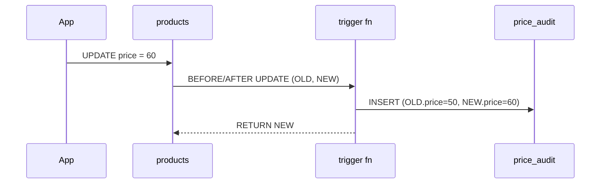

# Functions & Triggers

> Logic جوا الـ DB: functions = reusable SQL/PL/pgSQL. Triggers = function تشتغل تلقائياً على INSERT/UPDATE/DELETE.



## Function

```sql
CREATE FUNCTION user_total_spent(p_user bigint)
RETURNS numeric
LANGUAGE sql STABLE
AS $$
    SELECT coalesce(sum(o.qty * p.price), 0)
    FROM orders o JOIN products p ON p.id = o.product_id
    WHERE o.user_id = p_user;
$$;

SELECT user_total_spent(42);       -- 2731.40
```

## Trigger — audit لتغيير السعر

```sql
CREATE TABLE price_audit (
    product_id bigint, old_price numeric, new_price numeric,
    changed_at timestamptz DEFAULT now()
);

CREATE FUNCTION log_price_change() RETURNS trigger
LANGUAGE plpgsql AS $$
BEGIN
    IF NEW.price IS DISTINCT FROM OLD.price THEN
        INSERT INTO price_audit (product_id, old_price, new_price)
        VALUES (OLD.id, OLD.price, NEW.price);
    END IF;
    RETURN NEW;
END $$;

CREATE TRIGGER products_price_audit
AFTER UPDATE OF price ON products
FOR EACH ROW EXECUTE FUNCTION log_price_change();

UPDATE products SET price = price + 1 WHERE id = 1;
SELECT * FROM price_audit;
```

## Volatility

| Label | معناه | مثال |
|---|---|---|
| `IMMUTABLE` | نفس input = نفس output دايماً | `lower()` |
| `STABLE` | ثابت جوا query وحدة | lookups |
| `VOLATILE` | يتغيّر كل مرة | `random()`, writes |

## Key Points
- `updated_at` / audit = أشهر triggers
- Trigger logic مخفي → وثّقه
- `FOR EACH ROW` على bulk = بطيء

## Pitfall
❌ business logic كاملة بـ triggers → debugging كابوس
✅ triggers لـ invariants بسيطة فقط

Next → [02-views-matviews](02-views-matviews.md)
