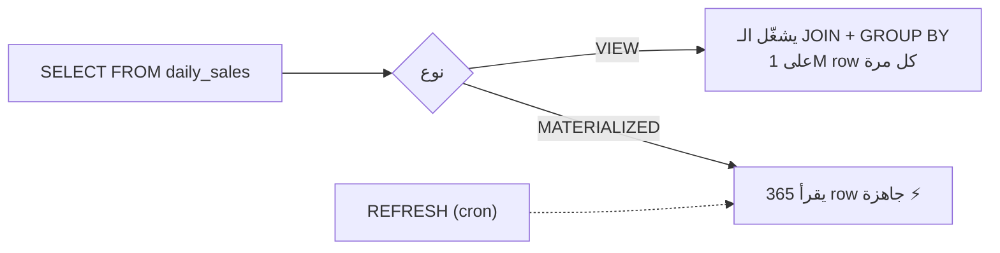

# Views & Materialized Views

> View = query محفوظة (بتنحسب كل مرة). Materialized view = نتيجة محفوظة على disk (بدها refresh).



## Example

```sql
CREATE MATERIALIZED VIEW daily_sales AS
SELECT o.created_at::date AS day,
       count(*)                AS orders,
       sum(o.qty * p.price)    AS revenue
FROM orders o JOIN products p ON p.id = o.product_id
WHERE o.status <> 'cancelled'
GROUP BY 1;

CREATE UNIQUE INDEX ON daily_sales (day);      -- مطلوب لـ CONCURRENTLY

SELECT * FROM daily_sales ORDER BY day DESC LIMIT 7;

REFRESH MATERIALIZED VIEW CONCURRENTLY daily_sales;   -- بدون قفل القراءة
```

## Numbers

| Source | Time |
|---|---|
| Query مباشرة (1M rows) | ~350 ms |
| Materialized view | ~0.3 ms |
| `REFRESH` | ~400 ms |

## Compare

| | VIEW | MATERIALIZED VIEW |
|---|---|---|
| Data حديثة | ✅ دايماً | ❌ لآخر refresh |
| سرعة | = الـ query | ⚡ |
| Indexes | ❌ | ✅ |
| استخدام | تبسيط / security | dashboards / reports |

## Key Points
- Refresh بـ cron أو `pg_cron`
- `CONCURRENTLY` يحتاج unique index
- View عادية ممتازة لإخفاء أعمدة حساسة

Next → [03-extensions](03-extensions.md)
