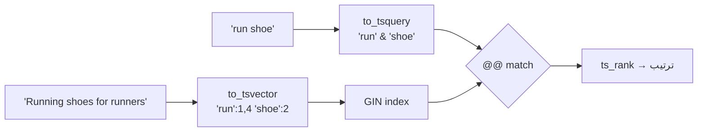

# Full-Text Search

> بحث بالكلمات (stemming + ranking) بدون Elasticsearch — كافي لمعظم الـ apps.



## Example

```sql
CREATE TABLE articles (
    id    bigint GENERATED ALWAYS AS IDENTITY PRIMARY KEY,
    title text,
    body  text,
    search tsvector GENERATED ALWAYS AS (
        setweight(to_tsvector('english', coalesce(title, '')), 'A') ||
        setweight(to_tsvector('english', coalesce(body,  '')), 'B')
    ) STORED
);
CREATE INDEX articles_search_idx ON articles USING gin (search);

INSERT INTO articles (title, body) VALUES
  ('Running shoes guide', 'Best shoes for runners in 2026'),
  ('Postgres indexing',   'B-Tree, GIN and BRIN explained');

SELECT title, ts_rank(search, q) AS rank
FROM articles, websearch_to_tsquery('english', 'running shoe') q
WHERE search @@ q
ORDER BY rank DESC;
--  Running shoes guide | 0.99
```

## FTS vs LIKE vs Elasticsearch

| | `LIKE '%x%'` | Postgres FTS | Elasticsearch |
|---|---|---|---|
| Stemming (run/running) | ❌ | ✅ | ✅ |
| Ranking | ❌ | ✅ | ✅✅ |
| Typos | ❌ (pg_trgm ✅) | ❌ | ✅ |
| Infra إضافية | — | — | cluster كامل |

## Key Points
- `websearch_to_tsquery` = syntax زي Google
- Generated column + GIN
- العربي: `simple` config أو extension خارجي

Next → [09-docker/01-image-volumes](../../09-docker/docs/01-image-volumes.md)
