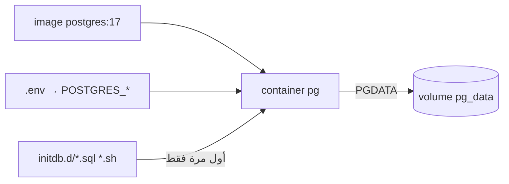

# Postgres in Docker — Image, Volumes, Env

> Container = مؤقت. Volume = الـ data الدائمة. ضيّع الـ volume = ضيّعت الـ DB.



## Example — docker run خام

```bash
docker volume create pg_data
docker run -d --name pg \
  -e POSTGRES_USER=app -e POSTGRES_PASSWORD=secret -e POSTGRES_DB=shop \
  -v pg_data:/var/lib/postgresql/data \
  -p 127.0.0.1:5432:5432 \
  postgres:17

docker rm -f pg            # container راح
docker run ... (نفس الأمر) # data لسا موجودة ✅ (بالـ volume)
```

## Env Vars

| Var | معناه |
|---|---|
| `POSTGRES_PASSWORD` | **مطلوب** (superuser) |
| `POSTGRES_USER` | default `postgres` |
| `POSTGRES_DB` | default = user |
| `POSTGRES_INITDB_ARGS` | مثلاً `--data-checksums` |
| `PGDATA` | مكان الـ data جوا الـ container |

## Image tags

| Tag | PGDATA |
|---|---|
| `postgres:17` | `/var/lib/postgresql/data` |
| `postgres:18` | `/var/lib/postgresql/18/docker` (mount `/var/lib/postgresql`) |

## Key Points
- Pin major: `postgres:17` مش `latest`
- Named volume > bind mount (permissions)
- Major upgrade = `pg_dump`/`pg_upgrade`، مش تغيير tag

## Pitfall
❌ `image: postgres:latest` → يوم يصير 18 الـ container ما بيقلع على data 17
✅ `image: postgres:17`

Next → [02-compose-healthcheck](02-compose-healthcheck.md)
