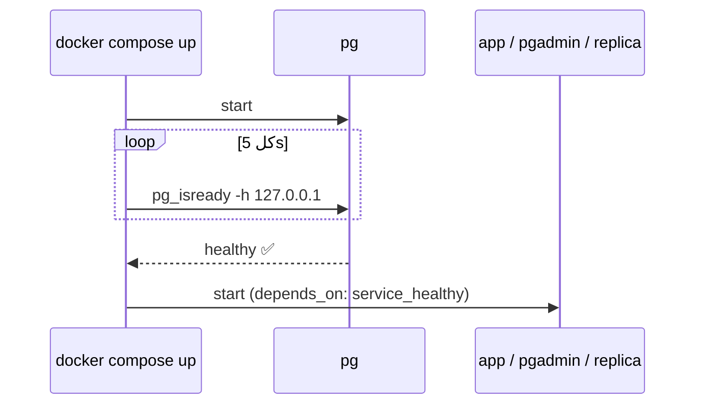

# Docker Compose — Config, Healthcheck, depends_on

> Compose = كل الـ stack بملف واحد. Healthcheck = الـ services الثانية بتستنى Postgres يكون جاهز فعلاً.



## Config — 3 طرق

```yaml
# 1) command flags (بسيط — مستخدم بهالـ repo)
command: >
  postgres -c shared_buffers=2GB -c max_connections=100

# 2) ملف كامل
command: postgres -c config_file=/etc/postgresql/postgresql.conf
volumes:
  - ./postgresql.conf:/etc/postgresql/postgresql.conf:ro

# 3) runtime (ينحفظ بـ postgresql.auto.conf)
#    ALTER SYSTEM SET work_mem = '16MB'; SELECT pg_reload_conf();
```

## Healthcheck

```yaml
healthcheck:
  test: ["CMD-SHELL", "pg_isready -h 127.0.0.1 -U $${POSTGRES_USER} -d $${POSTGRES_DB}"]
  interval: 5s
  retries: 30
```

| Detail | ليش |
|---|---|
| `-h 127.0.0.1` | أثناء init السيرفر المؤقت socket فقط → ما يصير healthy بدري |
| `$${VAR}` | `$$` = escape، الـ var ينقرأ جوا الـ container |

## Useful commands

| | |
|---|---|
| `docker compose ps` | status + health |
| `docker compose logs -f pg` | logs |
| `docker compose exec pg psql -U app shop` | psql |
| `docker compose restart pg` | بعد تغيير config |
| `docker stats` | CPU / RAM live |

## Pitfall
❌ `ports: "5432:5432"` → مفتوح للإنترنت (Docker يتجاوز UFW)
✅ `"127.0.0.1:5432:5432"`

Next → [10-vps-deploy/01-vps-setup](../../10-vps-deploy/docs/01-vps-setup.md)
