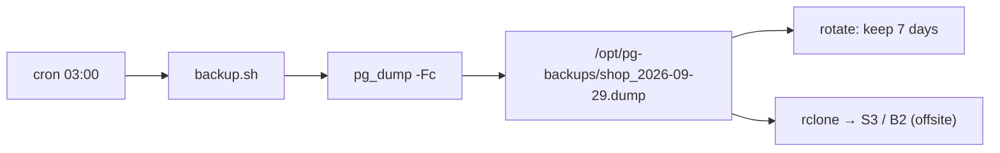

# Automated Backups

> `pg_dump` يومي بـ cron + حذف القديم + نسخة offsite + تجربة restore.



## Scripts

- [backup.sh](../scripts/backup.sh) — dump + rotate
- [restore.sh](../scripts/restore.sh) — restore لـ DB جديدة للتجربة

## Setup

```bash
chmod +x /opt/pg/10-vps-deploy/scripts/*.sh
/opt/pg/10-vps-deploy/scripts/backup.sh        # جرّب يدوي أول
ls -lh /opt/pg-backups/
# shop_2026-09-29_0300.dump  21M

crontab -e
0 3 * * * /opt/pg/10-vps-deploy/scripts/backup.sh >> /opt/pg-backups/backup.log 2>&1
```

## Offsite (اختياري)

```bash
apt install rclone && rclone config           # remote اسمه b2
# أضف بآخر backup.sh:
rclone copy /opt/pg-backups b2:my-bucket/pg --max-age 24h
```

## Restore Drill (كل شهر)

```bash
/opt/pg/10-vps-deploy/scripts/restore.sh /opt/pg-backups/shop_2026-09-29_0300.dump shop_restore_test
docker compose exec pg psql -U app -d shop_restore_test -c "SELECT count(*) FROM orders;"
#  1000000 ✅
```

## Numbers — shop DB

| | |
|---|---|
| Dump time | ~5 s |
| Size `-Fc` | ~20 MB |
| 7 days retention | ~140 MB |

## Pitfall
❌ `docker compose exec pg_dump > file` (بدون `-T`) → ملف فيه أحرف TTY خربانة
✅ `docker compose exec -T ...`

Next → [11-replication/01-streaming-replication](../../11-replication/docs/01-streaming-replication.md)
