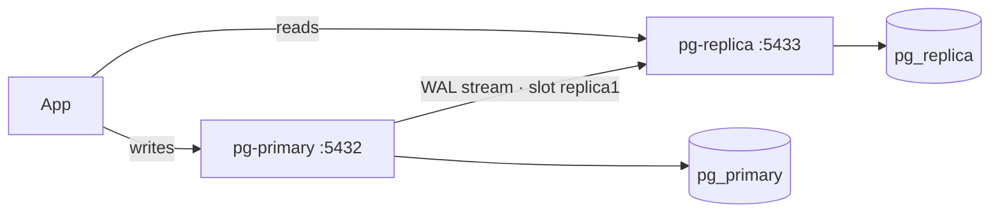
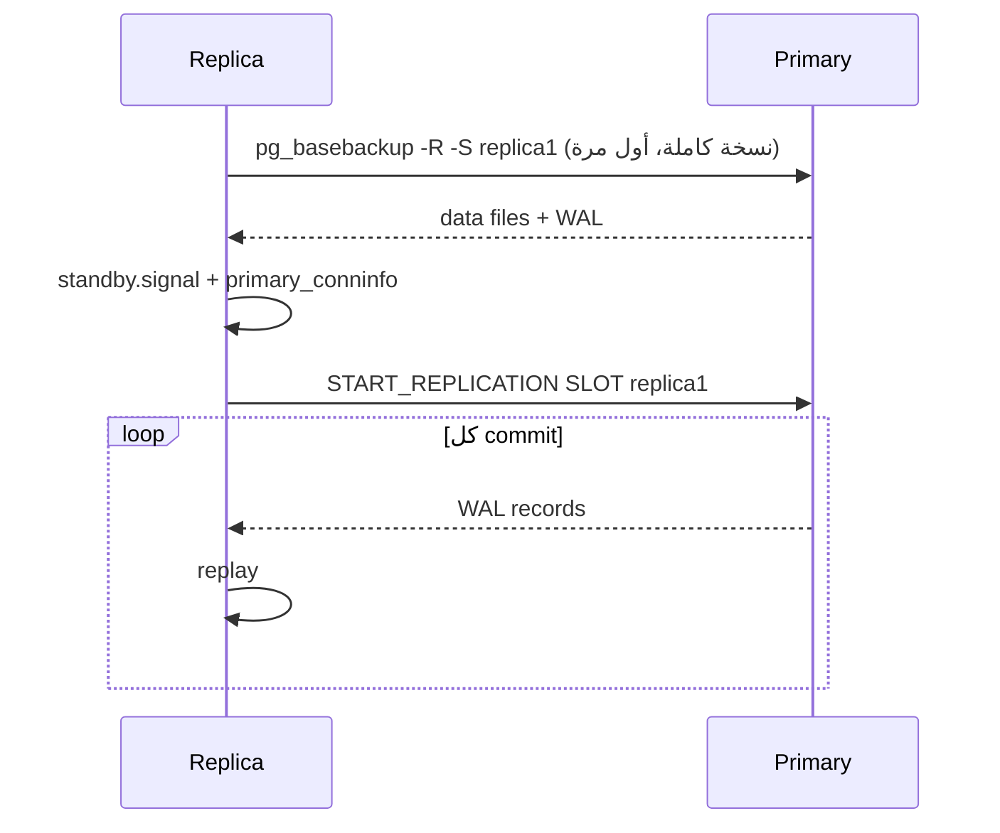

# Streaming Replication

> Primary يكتب → WAL ينبث live → Replica يعيد تطبيقه (read-only hot standby).





## Files

| File | Role |
|---|---|
| [docker-compose.yml](../docker-compose.yml) | primary + replica |
| [init/01-replication.sh](../init/01-replication.sh) | role `replicator` + slot + pg_hba |
| [.env.example](../.env.example) | passwords |

## Run

```bash
cd 11-replication
docker compose -f ../docker-compose.yml stop     # حرّر البورت 5432
cp .env.example .env                             # PRIMARY_PORT / REPLICA_PORT لو 5432 محجوز
docker compose up -d                             # ~1 دقيقة (1M order + pg_basebackup)
docker compose logs -f pg-replica
# ... "started streaming WAL from primary at 0/F000000 on timeline 1"
```
`port is already allocated`؟ → `docker ps --format '{{.Names}} {{.Ports}}' | grep 5432` وغيّر `PRIMARY_PORT` بالـ `.env`.

## Key settings

| Setting | Primary | ليش |
|---|---|---|
| `wal_level=replica` | ✅ | WAL فيه معلومات كافية |
| `max_wal_senders` | ≥ عدد replicas | processes ترسل WAL |
| `max_replication_slots` | ≥ عدد replicas | |
| `hot_standby=on` | replica | يسمح بالقراءة |

## pg_basebackup flags

| Flag | معناه |
|---|---|
| `-R` | ينشئ `standby.signal` + `primary_conninfo` |
| `-Xs` | يبث WAL أثناء النسخ |
| `-S replica1` | يستخدم الـ slot |
| `-P` | progress |

## Async vs Sync

| | Async (default) | Sync |
|---|---|---|
| COMMIT ينتظر replica | ❌ | ✅ |
| Data loss لو primary مات | آخر ms | صفر |
| Latency | ✅ | + RTT |

Sync: `synchronous_standby_names = 'replica1'` + `application_name=replica1` بالـ conninfo.

Next → [02-verify-lag](02-verify-lag.md)
