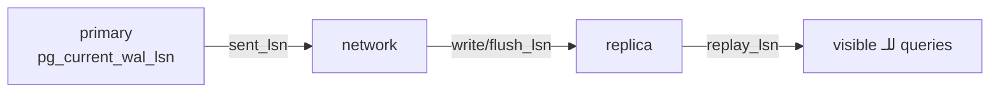

# Verify & Monitor Lag

> تأكد إنه الـ replica شغّال streaming، وقيس قديش متأخر.



## 1. Status على primary

```bash
docker compose exec pg-primary psql -U app -d shop -c \
 "SELECT client_addr, state, sync_state, replay_lag FROM pg_stat_replication;"
#  client_addr | state     | sync_state | replay_lag
#  172.18.0.3  | streaming | async      | 00:00:00.00089
```

## 2. Replica = read-only

```bash
docker compose exec pg-replica psql -U app -d shop -c "SELECT pg_is_in_recovery();"   # t
docker compose exec pg-primary psql -U app -d shop -c "CREATE TABLE t(id int); INSERT INTO t VALUES (1);"
docker compose exec pg-replica psql -U app -d shop -c "SELECT * FROM t;"              # 1 ✅
docker compose exec pg-replica psql -U app -d shop -c "INSERT INTO t VALUES (2);"
# ERROR: cannot execute INSERT in a read-only transaction ✅
```

## 3. Lag

```sql
-- على primary: bytes
SELECT application_name,
       pg_size_pretty(pg_wal_lsn_diff(pg_current_wal_lsn(), replay_lsn)) AS lag
FROM pg_stat_replication;

-- على replica: وقت (0 إذا كل اللي وصل انطبّق)
SELECT CASE WHEN pg_last_wal_receive_lsn() = pg_last_wal_replay_lsn() THEN interval '0'
            ELSE now() - pg_last_xact_replay_timestamp() END AS replay_delay;
```
⚠️ `now() - pg_last_xact_replay_timestamp()` لحاله بيكبر لما الـ primary يكون idle (مقاس: 20s مع lag = 0 bytes) → false alarm.

## 4. Slots — خطر الـ disk

```sql
SELECT slot_name, active,
       pg_size_pretty(pg_wal_lsn_diff(pg_current_wal_lsn(), restart_lsn)) AS retained_wal
FROM pg_replication_slots;
--  replica1 | f | 12 GB   ← 🚨 replica واقف والـ WAL عم يتراكم
```

حماية (PG13+):
```sql
ALTER SYSTEM SET max_slot_wal_keep_size = '10GB';
SELECT pg_reload_conf();
```

## Load test على replica

```bash
# custom read-only script (مش -S: جداول pgbench_* مش موجودة، وما بتقدر تعمل -i على replica)
docker compose exec pg-replica pgbench -U app -n -c 20 -T 30 -f /bench/read_heavy.sql shop
```
بدك `-S` الافتراضي؟ اعمل `pgbench -i -s 10` على **primary** أول، الجداول بتنتقل للـ replica.

## Alerts

| Metric | Warn |
|---|---|
| `state` ≠ streaming | فوراً |
| lag bytes | > 100 MB |
| `replay_delay` | > 30 s |
| slot `active = f` | > 5 min |

Next → [03-failover](03-failover.md)
