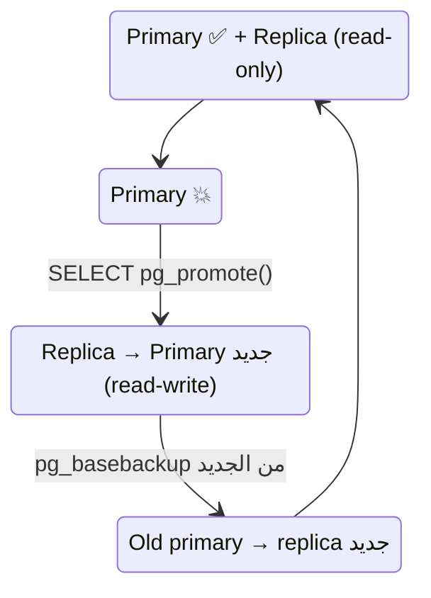

# Failover — Promote the Replica

> Primary وقع → رقّي الـ replica لـ primary → حوّل الـ app عليه.



## Drill

```bash
# 1. اقتل الـ primary
docker compose stop pg-primary

# 2. Promote
docker compose exec pg-replica psql -U app -d shop -c "SELECT pg_promote();"
docker compose exec pg-replica psql -U app -d shop -c "SELECT pg_is_in_recovery();"   # f ✅

# 3. الكتابة شغالة
docker compose exec pg-replica psql -U app -d shop -c "INSERT INTO t VALUES (99);"

# 4. App → :5433  (أو غيّر DNS / HAProxy)
```

## رجّع الـ setup (lab)

```bash
docker compose down -v && docker compose up -d     # أبسط للتعلّم
```
Production: الـ primary القديم **ما بيرجع primary** — ابنيه كـ replica من الجديد (`pg_basebackup` أو `pg_rewind`).

## Manual vs Automatic

| | Manual | Patroni / repmgr |
|---|---|---|
| Detect failure | أنت | تلقائي (etcd / consensus) |
| Promote | `pg_promote()` | تلقائي < 30s |
| Split-brain protection | ❌ عليك | ✅ fencing |
| Complexity | منخفض | عالي |

## Key Points
- Promote = نهائي (timeline جديد)
- جرّب الـ failover قبل ما تحتاجه
- Async → ممكن تخسر آخر ms

## Pitfall
❌ الـ primary القديم رجع لحاله وهو لسا primary → 2 primaries = **split-brain**
✅ `restart: "no"` للقديم أو fencing قبل الـ promote

Next → [04-two-vps](04-two-vps.md)
