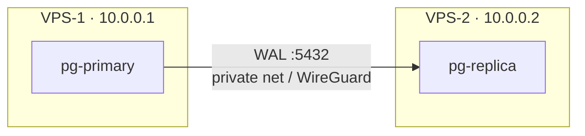

# Replica على VPS ثاني (Production)

> نفس الفكرة، بس الـ replica على سيرفر مختلف عبر private network — إذا الـ VPS الأول مات، الـ data سليمة.



## Primary (VPS-1) — التغييرات

```yaml
# 11-replication/docker-compose.yml → service pg-primary فقط
ports: ["10.0.0.1:5432:5432"]       # private IP، مش 0.0.0.0
```
```bash
# pg_hba: استبدل "all" بـ IP الـ replica (أول سطر مطابق هو اللي بيربح)
docker compose exec pg-primary bash -c \
  "sed -i 's#^host replication replicator all#host replication replicator 10.0.0.2/32#' \$PGDATA/pg_hba.conf"
docker compose exec pg-primary psql -U app -d shop -c "SELECT pg_reload_conf();"

ufw allow from 10.0.0.2 to any port 5432 proto tcp
```

## Replica (VPS-2) — `docker-compose.yml`

```yaml
services:
  pg-replica:
    image: postgres:17                 # نفس الـ major بالضبط
    user: postgres
    environment:
      PGPASSWORD: ${REPL_PASSWORD}
    entrypoint:
      - bash
      - -c
      - |
        if [ ! -s /var/lib/postgresql/data/PG_VERSION ]; then
          pg_basebackup -h 10.0.0.1 -U replicator \
            -D /var/lib/postgresql/data -Fp -Xs -P -R -S replica1
          chmod 0700 /var/lib/postgresql/data
        fi
        exec postgres
    volumes: [pg_replica:/var/lib/postgresql/data]
    ports: ["127.0.0.1:5432:5432"]
    restart: unless-stopped
volumes:
  pg_replica:
```

## Network options

| Option | ملاحظة |
|---|---|
| Provider private network (Hetzner / DO VPC) | الأسهل ✅ |
| WireGuard tunnel | أي providers |
| Public IP + `hostssl` + firewall | آخر حل |

## Checklist

| # | Check |
|---|---|
| 1 | `nc -zv 10.0.0.1 5432` من VPS-2 ✅ |
| 2 | نفس `postgres:17` بالطرفين |
| 3 | `pg_stat_replication` → `streaming` |
| 4 | Monitor lag + slots ([02](02-verify-lag.md)) |
| 5 | Backups لسا شغالة ([10](../../10-vps-deploy/docs/03-backups-cron.md)) |

## Pitfall
❌ `ports: "5432:5432"` على primary عشان الـ replica يوصل → مفتوح للعالم
✅ bind على الـ private IP + `ufw allow from 10.0.0.2`

Next → [12-benchmarking/01-pgbench-basics](../../12-benchmarking/docs/01-pgbench-basics.md)
