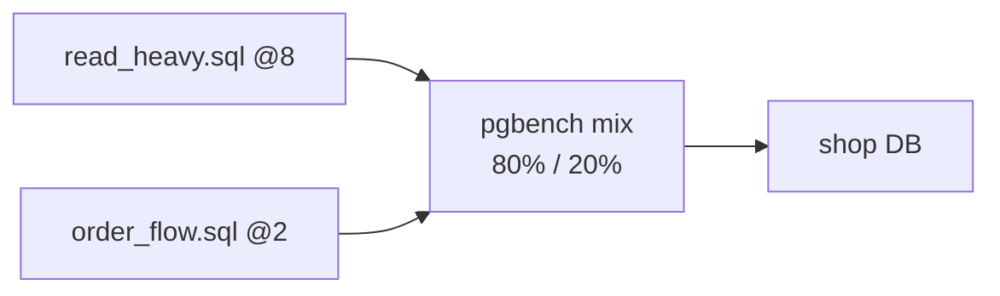

# Custom pgbench Scripts

> اختبر **queries الـ app تبعك** على جداول `shop`، مش TPC-B.



## Scripts

- [bench/read_heavy.sql](../bench/read_heavy.sql) — آخر 20 order لـ user
- [bench/order_flow.sql](../bench/order_flow.sql) — checkout transaction

```sql
-- order_flow.sql
\set uid random(1, 100000)
\set pid random(1, 5000)
BEGIN;
SELECT price FROM products WHERE id = :pid;
INSERT INTO orders (user_id, product_id, qty) VALUES (:uid, :pid, 1);
UPDATE products SET stock = stock - 1 WHERE id = :pid;
COMMIT;
```

## Run

```bash
# /repo = الـ repo mounted جوا الـ container
docker compose exec pg pgbench -U app -n -c 50 -j 4 -T 120 -P 10 \
  -f /repo/12-benchmarking/bench/read_heavy.sql@8 \
  -f /repo/12-benchmarking/bench/order_flow.sql@2 shop
```

| Syntax | معناه |
|---|---|
| `\set x random(1, N)` | uniform |
| `random_zipfian(1, N, 1.1)` | hot keys (واقعي أكثر) |
| `:x` | استخدم المتغير |
| `-f file@8` | وزن 8 |
| `-n` | ما تعمل vacuum لجداول pgbench |

## Before → After — index

| | `read_heavy` tps | avg latency |
|---|---|---|
| بدون `orders(user_id)` index | ~10–30 (تقدير) | ~340+ ms (seq scan) |
| مع `(user_id, created_at DESC)` | 4,997 (مقاس، 10 clients) | 2.0 ms |

(الصف الثاني مقاس على Docker Desktop 4 CPU · warm cache)

## Key Points
- Script = سيناريو حقيقي من الـ app
- `random_zipfian` = hot rows
- قارن دايماً نفس `-c -T -s`

## Pitfall
❌ `order_flow` بيضيف orders كل run → الجدول بيكبر والـ runs ما بتنقارن
✅ `DELETE FROM orders WHERE id > 1000000; VACUUM orders;` بين الـ runs (أو `down -v`)

Next → [03-ramp-and-monitor](03-ramp-and-monitor.md)
