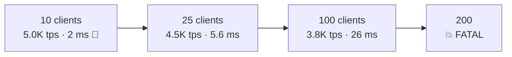
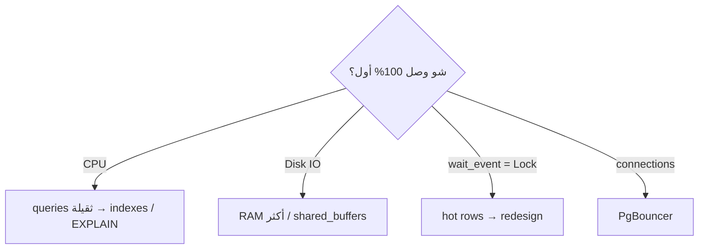

# Stress Test — Ramp Up & Monitor

> زيد clients تدريجياً لحد ما الـ TPS يوقف يزيد أو الـ latency تنفجر = حدود السيرفر.



## Run

```bash
docker compose exec pg bash /repo/12-benchmarking/bench/ramp.sh
```
[bench/ramp.sh](../bench/ramp.sh)

مقاس فعلياً (Docker Desktop · 4 CPU · warm cache · `CLIENTS="10 25 50 100 200" DURATION=15`):
```text
script=read_heavy.sql  duration=15s  threads=4
clients=10   latency=2.001 ms     tps=4997   ← 🎯 sweet spot (~2.5× cores)
clients=25   latency=5.599 ms     tps=4465
clients=50   latency=13.732 ms    tps=3641   ← latency ×7، tps أقل!
clients=100  latency=26.078 ms    tps=3834
clients=200  💥 FATAL:  sorry, too many clients already   ← max_connections=100
```

الدرس: بعد ~2–3× عدد الـ cores، زيادة الـ clients **بتنزّل** الـ throughput (context switching + contention) → **PgBouncer** ([07](../../07-ops-scaling/docs/04-pgbouncer.md))، مش `max_connections` أكبر.

⚠️ أول run بعد restart = cold cache (عندي: 1,018 tps بدل 4,997) → اعمل warm-up run وتجاهل نتيجته.

## Monitor — terminal ثاني

```bash
docker stats                                        # CPU / RAM
docker compose exec pg psql -U app -d shop -f /repo/12-benchmarking/bench/monitor.sql
```
[bench/monitor.sql](../bench/monitor.sql) بيطلع:

| Query | شو بتدوّر عليه |
|---|---|
| `pg_stat_activity` by wait_event | `Lock` كثير = contention · `IO` = disk |
| cache hit ratio | لازم > 99% |
| `pg_stat_statements` top 5 | الـ query المسؤولة |
| checkpoints | `requested` كثير = `max_wal_size` صغير |

## Bottleneck Map



## Pitfall
❌ pgbench على نفس السيرفر → بياكل CPU من Postgres
✅ Production-like: شغّله من VPS ثاني (`-h <ip>`)

Next → [04-tuning-before-after](04-tuning-before-after.md)
