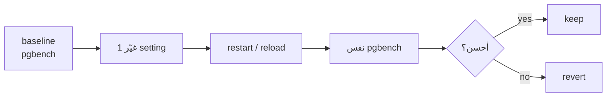

# Tuning — Before → After

> غيّر setting **واحد** → أعد نفس الـ benchmark → سجّل الفرق.



## Config — VPS 4 vCPU / 8 GB / SSD

```yaml
# docker-compose.yml → pg.command
command: >
  postgres
    -c shared_preload_libraries=pg_stat_statements
    -c shared_buffers=2GB
    -c effective_cache_size=6GB
    -c work_mem=16MB
    -c maintenance_work_mem=512MB
    -c max_wal_size=4GB
    -c checkpoint_completion_target=0.9
    -c random_page_cost=1.1
    -c effective_io_concurrency=200
```
```bash
docker compose up -d        # يعيد إنشاء الـ container بالـ config الجديد
docker compose exec pg psql -U app -d shop -c "SHOW shared_buffers;"
```

## Settings

| Setting | Default | Tuned | Rule |
|---|---|---|---|
| `shared_buffers` | 128MB | 2GB | 25% RAM |
| `effective_cache_size` | 4GB | 6GB | 75% RAM (hint فقط) |
| `work_mem` | 4MB | 16MB | لكل sort/hash × connections! |
| `max_wal_size` | 1GB | 4GB | checkpoints أقل |
| `random_page_cost` | 4 | 1.1 | SSD |

## Results Template

| Run | Change | TPS | avg ms | stddev |
|---|---|---|---|---|
| 0 | baseline | 2,400 | 20.8 | 8.1 |
| 1 | `shared_buffers=2GB` | 3,100 | 16.1 | 6.0 |
| 2 | + `max_wal_size=4GB` | 3,350 | 14.9 | 3.2 |
| 3 | + `synchronous_commit=off` | 5,900 | 8.5 | 2.9 |

(أرقام توضيحية — سجّل أرقامك بـ [results.md](../results.md))

## Key Points
- PGTune (pgtune.leopard.in.ua) نقطة بداية
- `synchronous_commit=off` = سرعة مقابل آخر ~600ms
- الـ index الصح > أي tuning

## Pitfall
❌ `work_mem=1GB` مع 100 connection → OOM
✅ صغير global، أكبر per-session: `SET work_mem='256MB'` للـ reports

Next → [05-pgtap](05-pgtap.md)
