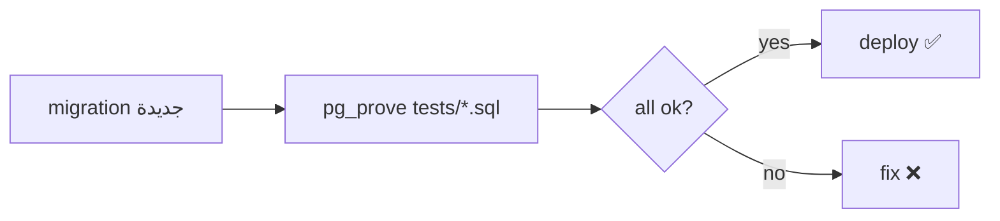

# Correctness Tests — pgTAP

> Stress test بيقيس السرعة؛ pgTAP بيتأكد إنه الـ schema والـ constraints والـ functions **صح**.



## Install (مرة وحدة بالـ container)

```bash
docker compose exec pg bash -c \
  "apt-get update && apt-get install -y postgresql-17-pgtap libtap-parser-sourcehandler-pgtap-perl"
docker compose exec pg psql -U app -d shop -c "CREATE EXTENSION IF NOT EXISTS pgtap;"
```

## Test — [tests/test_schema.sql](../tests/test_schema.sql)

```sql
BEGIN;
SELECT plan(6);

SELECT has_table('orders');
SELECT col_not_null('orders', 'user_id');
SELECT fk_ok('orders', 'user_id', 'users', 'id');
SELECT throws_ok(
  $$INSERT INTO orders (user_id, product_id, qty) VALUES (1, 1, -5)$$,
  '23514', NULL, 'qty must be positive');
SELECT throws_ok(
  $$INSERT INTO users (email, name, country) VALUES ('user1@shop.test', 'x', 'JO')$$,
  '23505', NULL, 'email is unique');
SELECT lives_ok(
  $$INSERT INTO orders (user_id, product_id, qty) VALUES (1, 1, 1)$$,
  'valid order inserts');

SELECT * FROM finish();
ROLLBACK;
```

## Run

```bash
docker compose exec pg pg_prove -U app -d shop /repo/12-benchmarking/tests/test_schema.sql
# /repo/12-benchmarking/tests/test_schema.sql .. ok
# All tests successful.  Files=1, Tests=6
```

## Key Points
- كل test جوا `BEGIN ... ROLLBACK`
- اختبر constraints + triggers + functions
- شغّلها بالـ CI قبل كل migration

🏁 Next → [Capstone](../../projects/ecommerce-backend/README.md)
