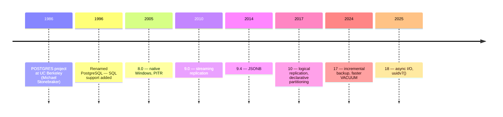
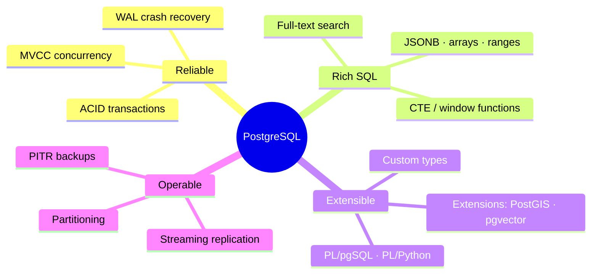

# What is PostgreSQL?

> An open-source **object-relational database engine**: it stores data in tables, speaks SQL, guarantees ACID, and can be extended with new types, indexes, and languages.



## What you get



## Example — one engine, many workloads

```sql
-- Relational
SELECT u.email, count(o.id) FROM users u JOIN orders o ON o.user_id = u.id GROUP BY 1;

-- Document
SELECT name FROM products WHERE attrs @> '{"color": "red"}';

-- Search
SELECT title FROM articles WHERE search @@ websearch_to_tsquery('running shoes');

-- Vector (pgvector)
SELECT body FROM docs ORDER BY embedding <=> '[0.1, 0.9, 0.3]' LIMIT 5;
```

## Numbers

| | |
|---|---|
| License | PostgreSQL License (MIT-like, free for commercial use) |
| Release cycle | 1 major / year, 5 years of support each |
| Max table size | 32 TB (default 8 KB pages) |
| Max row / field size | 1.6 TB / 1 GB |
| Version in this repo | 17.11 (`SELECT version();`) |

## Key Points
- "Postgres" = same thing
- Community-owned, no single vendor
- Default choice for new backends

Next → [02-postgresql-vs-sql-server](02-postgresql-vs-sql-server.md)
