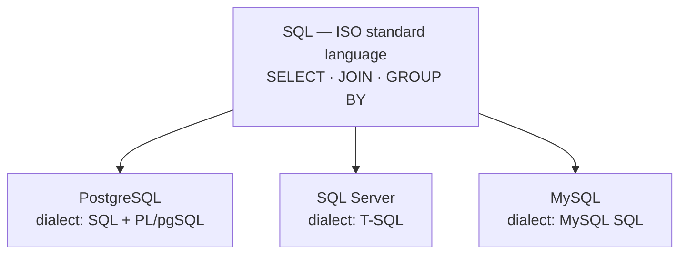

# PostgreSQL vs SQL (Server)

> **SQL** is a *language*. **PostgreSQL** and **SQL Server** are *engines* that speak their own dialect of it.



## Engine comparison

| | PostgreSQL | SQL Server |
|---|---|---|
| License / cost | Free, open source | Commercial (Express free, ≤ 10 GB DB) |
| OS | Linux, Windows, macOS | Windows, Linux |
| Procedural language | PL/pgSQL (+ Python, JS…) | T-SQL |
| Concurrency default | MVCC — readers never block writers | Locking; MVCC only with `READ_COMMITTED_SNAPSHOT` ON |
| Table storage | Heap (unordered) + separate indexes | Usually a **clustered index** (rows ordered by PK) |
| Old row versions | In the table → cleaned by `VACUUM` | In `tempdb` version store |
| Identifier case | Folded to lowercase (`Users` → `users`) | As-is, compared by collation |
| String compare | Case-sensitive (`'A' <> 'a'`) | Usually case-insensitive (default collation) |
| JSON | `jsonb` binary type + GIN index | `nvarchar` + JSON functions (native `json` type in 2025) |
| Extensions | Huge ecosystem (PostGIS, pgvector…) | Limited (CLR) |
| HA | Streaming replication + Patroni | Always On Availability Groups |
| Tooling | psql, pgAdmin, DBeaver | SSMS, Azure Data Studio |

## Syntax translation

| Task | SQL Server (T-SQL) | PostgreSQL |
|---|---|---|
| First N rows | `SELECT TOP 10 *` | `SELECT * … LIMIT 10` |
| Auto-increment | `INT IDENTITY(1,1)` | `bigint GENERATED ALWAYS AS IDENTITY` |
| Concatenate | `'a' + 'b'` | `'a' \|\| 'b'` |
| Boolean | `bit` | `boolean` |
| Now | `GETDATE()` | `now()` |
| Null fallback | `ISNULL(x, 0)` | `COALESCE(x, 0)` |
| Upsert | `MERGE` | `INSERT … ON CONFLICT` (or `MERGE`) |
| Get inserted id | `OUTPUT inserted.id` | `RETURNING id` |
| Case-insensitive match | `LIKE` (collation) | `ILIKE` |
| Temp table | `#tmp` | `CREATE TEMP TABLE tmp` |

## Example — same query, two dialects

```sql
-- SQL Server
SELECT TOP 5 Name, Price FROM dbo.Products
WHERE Name LIKE 'key%' ORDER BY Price DESC;

-- PostgreSQL
SELECT name, price FROM products
WHERE name ILIKE 'key%' ORDER BY price DESC LIMIT 5;
```

## Pitfall
❌ `CREATE TABLE "Users" (...)` → you must quote `"Users"` forever
✅ `snake_case` without quotes: `CREATE TABLE users (...)`

Next → [03-architecture](03-architecture.md)
