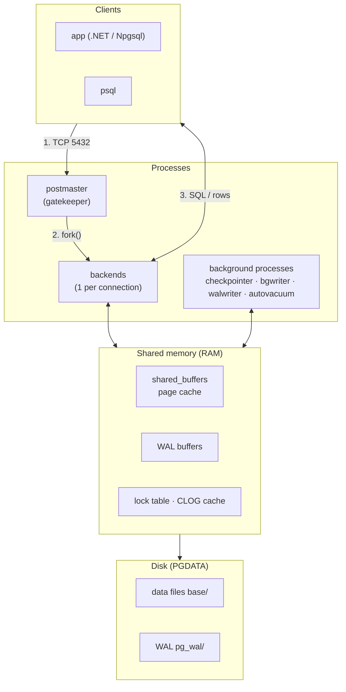
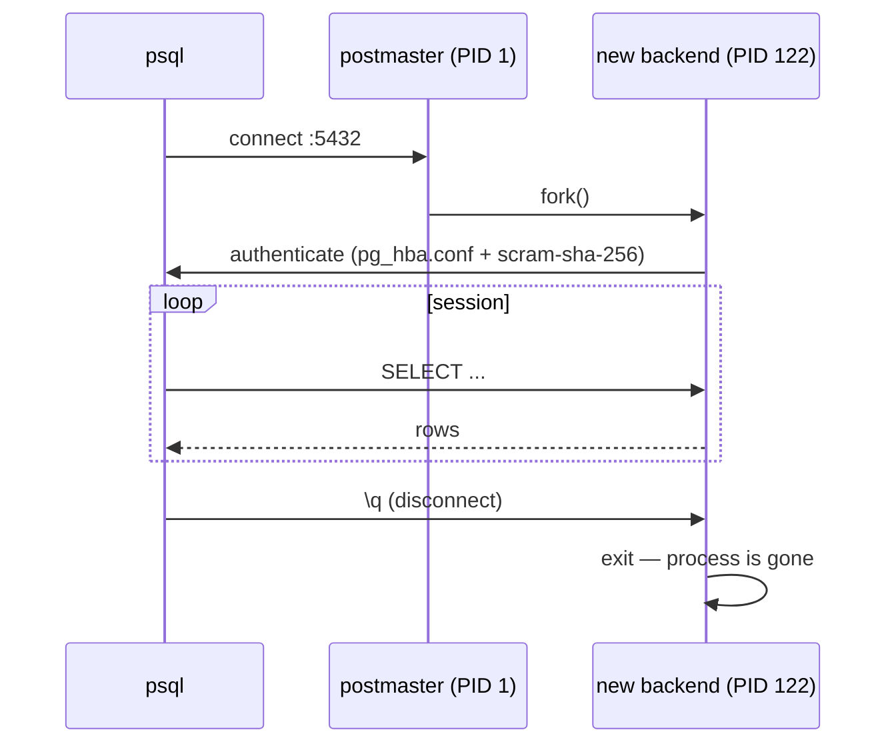
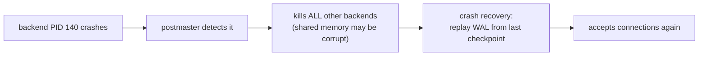
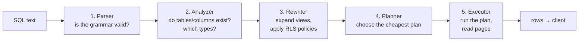
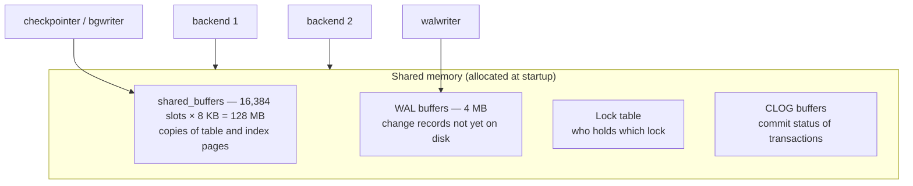
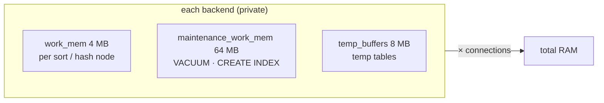
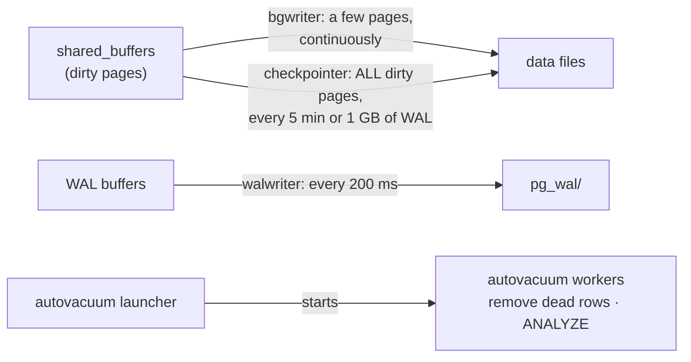
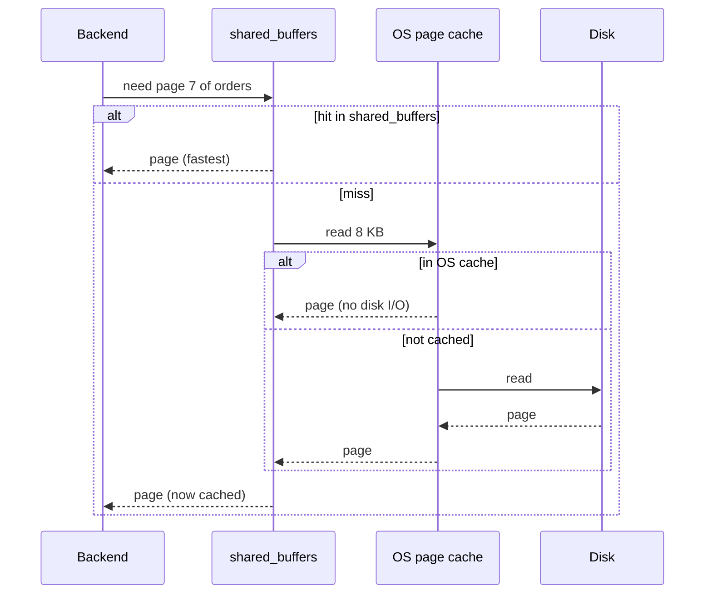
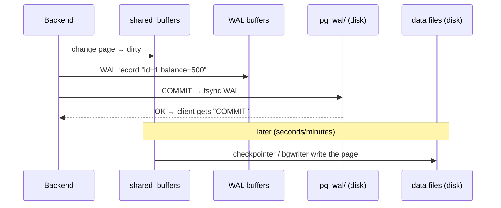
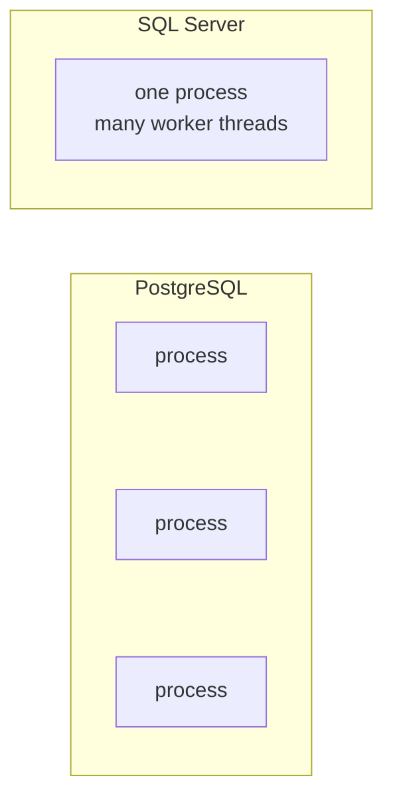

# PostgreSQL Architecture

> **Definition:** a running PostgreSQL server (called a **cluster**) is a **group of separate OS processes** that cooperate through **one shared block of RAM** and store everything in **one data directory** (`$PGDATA`) on disk.

Three building blocks, nothing more:

| Block | Definition | Lives in |
|---|---|---|
| **Processes** | programs the OS runs; each one has its own PID | CPU |
| **Memory** | RAM: one part shared by all processes, one part private to each process | RAM |
| **Files** | tables, indexes, WAL, config | disk (`$PGDATA`) |

## 0. Vocabulary first

Read this table once — every section below uses these words.

| Term | Definition | Example |
|---|---|---|
| **Process** | an independent running program with its own PID and private memory | `postgres: checkpointer` = PID 26 |
| **fork()** | Linux call that clones a process into a new child process | postmaster forks PID 122 for your `psql` |
| **Page** (block) | the unit PostgreSQL reads/writes: always **8 KB** | `orders` = 73 MB = 9,346 pages |
| **Buffer** | one 8 KB slot in RAM holding a copy of one page | `shared_buffers` = 16,384 buffers |
| **Cache hit / miss** | page already in RAM / must be read from disk | `shared hit=529 read=8817` |
| **Dirty page** | a page changed in RAM but not yet written to its data file | after `UPDATE`, before checkpoint |
| **WAL** (Write-Ahead Log) | an append-only journal of every change, written **before** the data file | `pg_wal/000000010000000000000001` |
| **fsync** | force the OS to really write bytes to disk (not just to OS cache) | done on every `COMMIT` |
| **Checkpoint** | moment when all dirty pages are written, so old WAL is no longer needed | every 5 min by default |

## 1. The big picture

### Analogy — a restaurant

| Restaurant | PostgreSQL | Section |
|---|---|---|
| Host at the door | **postmaster** | [2](#2-postmaster--the-gatekeeper) |
| One waiter per table of customers | **backend** (one per connection) | [3](#3-backend--your-sessions-worker) |
| Shared kitchen counter everyone uses | **shared memory** | [4](#4-shared-memory--what-every-process-sees) |
| Waiter's own notepad | **per-backend memory** (`work_mem`) | [5](#5-per-backend-memory--the-part-that-multiplies) |
| Cleaners, dishwashers, stock keepers | **background processes** | [6](#6-background-processes--the-janitors) |
| Order receipts book | **WAL** | [8](#8-write-path--why-wal-exists) |
| Storeroom / fridge | **data files** on disk | [9](#9-on-disk--pgdata) |



| Layer | What it is | Measured in this repo |
|---|---|---|
| Processes | separate Linux processes, not threads | 6 at idle |
| Shared memory | one region every process maps | `shared_buffers` = 128 MB |
| Disk | files under `$PGDATA` | `orders` heap = 73 MB |

---

## 2. postmaster — the gatekeeper

**Definition:** the **first** PostgreSQL process. It starts the server, allocates shared memory, listens on port `5432`, and creates (forks) one backend for each new connection. **It never executes SQL itself.**

**Three jobs:**
1. **Listen** — wait for clients on TCP `5432`.
2. **Fork** — create a new backend per connection.
3. **Supervise** — restart background processes; if any backend crashes, run crash recovery.

**Scenario A — normal connection:** you run `psql -h localhost -U app shop`.



**Scenario B — one backend crashes** (e.g. killed by the OS out-of-memory killer):



→ Every connected app sees `server closed the connection unexpectedly` for a few seconds, even sessions unrelated to the crash.

| Consequence | Number |
|---|---|
| Cost of a new connection | fork + auth ≈ a few ms |
| Memory per idle backend | ~5–10 MB |
| Limit | `max_connections` = 100 → use a pooler ([08-04](../08-ops-scaling/04-pgbouncer.md)) |

Check it yourself:
```sql
SHOW port;             -- 5432
SHOW max_connections;  -- 100
```

---

## 3. Backend — your session's worker

**Definition:** a **backend** is the process that serves **exactly one client connection** from login to logout. It receives your SQL, runs it, and sends the rows back. 10 open connections = 10 backends.

**Scenario:** your .NET app opens a connection and runs:

```sql
SELECT * FROM orders WHERE user_id = 42;
```

The backend passes the text through 5 stages:



| Stage | Definition | Error it can raise | Decision it makes |
|---|---|---|---|
| Parser | checks SQL **grammar** only, builds a parse tree | `syntax error at or near "FORM"` | — |
| Analyzer | looks up names in the catalog, resolves types | `relation "order" does not exist` | `user_id` is `bigint` |
| Rewriter | rewrites the query: views → their SQL, RLS → extra `WHERE` | — | appends `tenant_id = 7` from an RLS policy |
| Planner | estimates cost of each possible plan using table statistics | — | Index Scan (0.36 ms) instead of Seq Scan (631 ms) |
| Executor | runs plan nodes, fetches pages via `shared_buffers` | `division by zero` | — |

See your own backend:
```sql
SELECT pg_backend_pid();   -- e.g. 122
SELECT pid, state, query FROM pg_stat_activity WHERE backend_type = 'client backend';
```

---

## 4. Shared memory — what every process sees

**Definition:** a block of RAM allocated **once at startup** by the postmaster. Every backend and background process can read and write it. It is how separate processes cooperate.



### 4.1 shared_buffers — the page cache

**Definition:** PostgreSQL's own cache of 8 KB pages. Every read and write of a table/index goes through here; backends never touch data files directly.

**Scenario:**
1. Backend 1 runs `SELECT * FROM users WHERE id = 5` → page 0 of `users` not in cache → read from disk → stored in a buffer.
2. Backend 2 runs the same query 1 second later → page is already there → **cache hit**, no disk I/O.
3. Cache full → the least-used buffer is evicted (algorithm: *clock-sweep*).

### 4.2 WAL buffers

**Definition:** a small RAM area where change records (WAL) are collected before being written to `pg_wal/`.

**Scenario:** `INSERT` of 1 row → a ~100-byte WAL record goes into WAL buffers → at `COMMIT` it is flushed to disk.

### 4.3 Lock table

**Definition:** a shared list of **who holds which lock on what**. Needed because two processes must know about each other's locks.

**Scenario:**
```sql
-- session A (backend 122)
BEGIN; ALTER TABLE orders ADD COLUMN note text;   -- takes AccessExclusiveLock
-- session B (backend 130)
SELECT * FROM orders;   -- sees A's lock in the lock table → waits
```
`SELECT * FROM pg_locks;` shows the table.

### 4.4 CLOG buffers (commit log)

**Definition:** a cache of the status of each transaction ID: *in progress / committed / aborted*. Used by MVCC to decide whether a row version is visible ([06-03](../06-transactions-mvcc/03-mvcc.md)).

**Scenario:** a row was inserted by transaction `xid 750`. Your `SELECT` checks CLOG: `750 = committed` → row visible. `750 = aborted` → row ignored.

---

## 5. Per-backend memory — the part that multiplies

**Definition:** RAM that **each backend allocates privately** while running a query. Not shared → it is multiplied by the number of connections.

| Setting | Definition | Used by | Default |
|---|---|---|---|
| `work_mem` | max RAM for **one** sort or hash operation before spilling to temp files on disk | `ORDER BY`, `GROUP BY`, hash joins, `DISTINCT` | 4 MB |
| `maintenance_work_mem` | RAM for maintenance commands | `VACUUM`, `CREATE INDEX` | 64 MB |
| `temp_buffers` | cache for temporary tables | `CREATE TEMP TABLE` | 8 MB |



**Scenario 1 — too small:** sorting 50 MB with `work_mem = 4 MB`:
```text
EXPLAIN ANALYZE SELECT * FROM orders ORDER BY amount;
Sort Method: external merge  Disk: 51200kB      ← spilled to disk = slow
SET work_mem = '64MB';
Sort Method: quicksort  Memory: 52000kB         ← in RAM = fast
```

**Scenario 2 — too big (worst case):**
```text
100 connections × 4 MB work_mem × 2 sort/hash nodes per query = 800 MB
+ shared_buffers                                              = 128 MB
                                                              ≈ 930 MB
raise work_mem to 64 MB → the same load can need ≈ 12.9 GB → OOM killer
```

Rule: raise `work_mem` per session for one heavy report, not globally.

---

## 6. Background processes — the janitors

**Definition:** processes started by the postmaster that run **without any client**. They do housekeeping (writing to disk, cleaning) so your backend doesn't have to wait.



### 6.1 checkpointer

**Definition:** periodically writes **all** dirty pages to data files and records a *checkpoint* = "everything before this point is safely on disk".

**Scenario:** server crashes at 10:07. Last checkpoint at 10:05 → recovery only replays 2 minutes of WAL, not the whole day.
Trigger: `checkpoint_timeout = 5min` or `max_wal_size = 1GB`, whichever comes first.

### 6.2 background writer (bgwriter)

**Definition:** writes **a few** dirty pages continuously, so there are always clean buffers ready to reuse.

**Scenario:** a backend needs a free buffer for a new page. If every buffer is dirty, the backend must write one to disk itself first → your query waits. bgwriter prevents that.

### 6.3 walwriter

**Definition:** flushes WAL buffers to `pg_wal/` every `wal_writer_delay = 200ms`.

**Scenario:** with `synchronous_commit = off`, `COMMIT` returns immediately without fsync; walwriter writes the WAL within ~200 ms. Crash in that window → last ~200 ms of commits lost (no corruption).

### 6.4 autovacuum launcher + workers

**Definition:** the launcher checks tables periodically and starts **workers** that run `VACUUM` (remove dead row versions) and `ANALYZE` (refresh planner statistics).

**Scenario:** `UPDATE orders SET status='paid'` on 1M rows → leaves 1M **dead** row versions (MVCC). Without autovacuum the table grows from 73 MB to ~146 MB and stays slow ([07-03](../07-internals/03-vacuum.md)).

### 6.5 Real process list

Read from `/proc` inside the container:

| PID | Process | Job | If it falls behind |
|---|---|---|---|
| 1 | postmaster | fork & supervise | — |
| 26 | checkpointer | flush all dirty pages, mark a restart point | long crash recovery, WAL piles up |
| 27 | background writer | pre-clean dirty pages | backends write pages themselves → slower queries |
| 29 | walwriter | flush WAL buffers | async commits wait longer |
| 30 | autovacuum launcher | schedule vacuum workers | table bloat |
| 31 | logical replication launcher | start logical replication workers | — |
| 122 | client backend | **your psql session** | — |

Started only when needed: `walsender` (a replica connects — [14](../14-replication/01-streaming-replication.md)), `archiver` (`archive_mode = on`), parallel workers, autovacuum workers.

```sql
SELECT pid, backend_type FROM pg_stat_activity ORDER BY pid;
```

---

## 7. Read path — cache hit vs miss

**Scenario:** `SELECT * FROM orders WHERE id = 1000` needs page 7 of `orders`.



Two caches exist: PostgreSQL's `shared_buffers` **and** Linux's OS page cache.

Measured on `orders` with `EXPLAIN (ANALYZE, BUFFERS)`:

| Run | Buffers | Time |
|---|---|---|
| cold | `shared hit=529 read=8817` (5% from cache) | 631 ms |
| warm | most pages already cached | 340 ms |

---

## 8. Write path — why WAL exists

**Problem:** writing every changed 8 KB page to its data file at `COMMIT` = many random disk writes = slow.
**Solution:** write a small **sequential** WAL record at `COMMIT`; write the data pages later in the background.

**Scenario:** `UPDATE accounts SET balance = 500 WHERE id = 1; COMMIT;`



**Crash right after COMMIT?** Data file still has the old balance, but WAL has the change → on restart, crash recovery replays WAL → balance = 500. Nothing lost.

Only WAL must reach disk at COMMIT. Details: [05-crud-internals](05-crud-internals.md) · [07-02 WAL](../07-internals/02-wal.md).

---

## 9. On disk — `$PGDATA`

**Definition:** the **data directory**: one folder holding everything the cluster stores. Find it with `SHOW data_directory;`.

```text
base/16384/16665   ← one table: database oid 16384 (shop) / file node 16665
global/            ← cluster-wide catalogs (roles, databases)
pg_wal/            ← WAL segments, 16 MB each
pg_xact/           ← commit status of every transaction (CLOG on disk)
postgresql.conf    ← settings (shared_buffers, work_mem, …)
pg_hba.conf        ← who may connect, from where, how
```

**Scenario:** which file is my table?
```sql
SELECT oid FROM pg_database WHERE datname = 'shop';   -- 16384
SELECT pg_relation_filepath('orders');                -- base/16384/16665
```

More: [04-storage-layout](04-storage-layout.md).

---

## 10. Full scenario — one order, end to end

The .NET app inserts one order.

```mermaid
sequenceDiagram
    participant App as .NET app
    participant PM as postmaster
    participant BE as backend
    participant SM as shared memory
    participant BG as background procs
    participant D as disk
    App->>PM: 1. connect
    PM->>BE: 2. fork()
    App->>BE: 3. INSERT INTO orders ... ; COMMIT
    BE->>BE: 4. parse → analyze → plan → execute
    BE->>SM: 5. new row in a page in shared_buffers (dirty)<br/>+ WAL record in WAL buffers
    BE->>D: 6. COMMIT → fsync WAL to pg_wal/
    BE-->>App: 7. "INSERT 0 1"
    BG->>D: 8. later: checkpointer writes page to base/16384/16665
    BG->>SM: 9. later: autovacuum runs ANALYZE (stats updated)
```

| Step | Component |
|---|---|
| 1–2 | postmaster |
| 3–4 | backend |
| 5 | shared memory (shared_buffers + WAL buffers) |
| 6 | WAL on disk |
| 8–9 | background processes |

---

## 11. vs SQL Server



| | PostgreSQL | SQL Server |
|---|---|---|
| Unit per connection | OS process | worker thread |
| A crashing session | its process dies, postmaster recovers | contained inside one process |
| Thousands of connections | expensive → pooler | cheaper |

## Key Points
- **postmaster** forks; **backends** run your SQL; **background processes** flush and clean
- **shared_buffers** is shared by all; **work_mem** is private and multiplies by connections
- At COMMIT only **WAL** is fsynced; data files catch up at the next checkpoint
- Crash → WAL replay from last checkpoint → no committed data lost

Next → [04-storage-layout](04-storage-layout.md)
