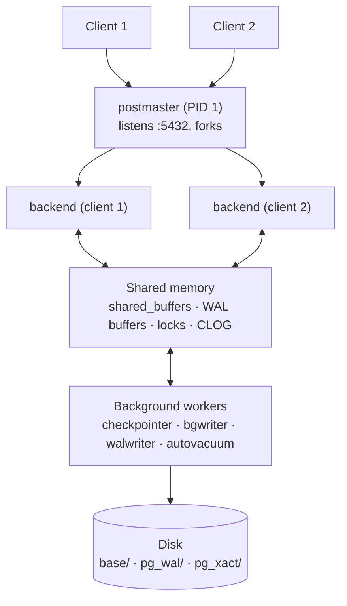
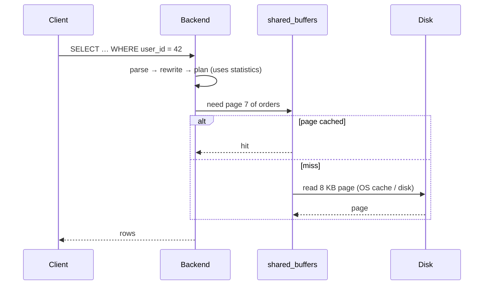

# PostgreSQL Architecture

> **One process per connection** + shared memory + background workers + files on disk.



## Processes — real output from this repo's container

```sql
SELECT backend_type, count(*) FROM pg_stat_activity GROUP BY 1;
--  autovacuum launcher          | 1
--  background writer            | 1
--  checkpointer                 | 1
--  client backend               | 1   ← your psql session
--  logical replication launcher | 1
--  walwriter                    | 1
```

| Process | Job |
|---|---|
| postmaster | Accepts connections, forks one backend each, restarts crashed children |
| backend | Parses, plans, executes **your** queries |
| checkpointer | Flushes all dirty pages to disk periodically |
| background writer | Writes some dirty pages early → backends rarely wait |
| walwriter | Flushes WAL buffers to `pg_wal/` |
| autovacuum | Removes dead row versions, updates statistics |
| walsender | Streams WAL to replicas ([12](../12-replication/01-streaming-replication.md)) |

## Memory

| Area | Scope | Default (this repo) |
|---|---|---|
| `shared_buffers` | shared page cache | 128 MB (16384 × 8 KB) |
| `wal_buffers` | shared WAL staging | 4 MB (512 × 8 KB) |
| `work_mem` | **per sort/hash, per backend** | 4 MB |
| `max_connections` | backend limit | 100 |

## Query life cycle



## Data directory (`$PGDATA`)

```text
base/16384/16665   ← one table (database oid / file node)
global/            ← cluster-wide catalogs (roles, databases)
pg_wal/            ← WAL segments, 16 MB each
pg_xact/           ← commit status of every transaction (CLOG)
postgresql.conf    ← settings
pg_hba.conf        ← who may connect, how
```

## Key Points
- Connection = OS process (~5–10 MB) → use a pool
- All backends share one page cache
- Crash of one backend → postmaster resets all

Next → [04-storage-layout](04-storage-layout.md)
