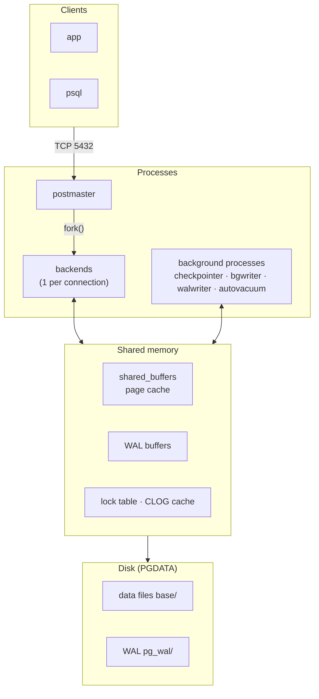
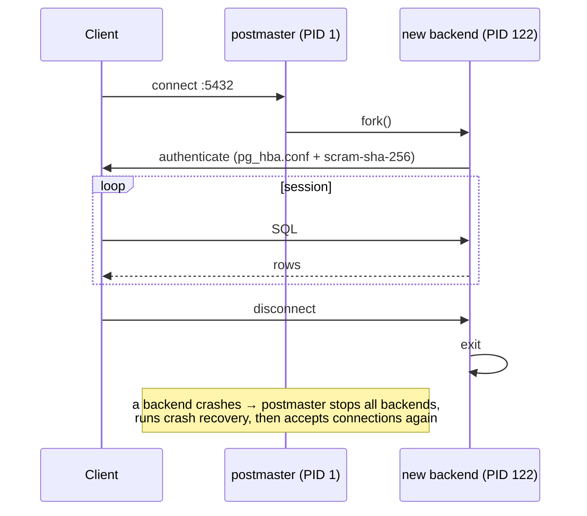
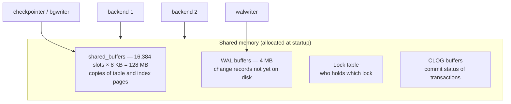
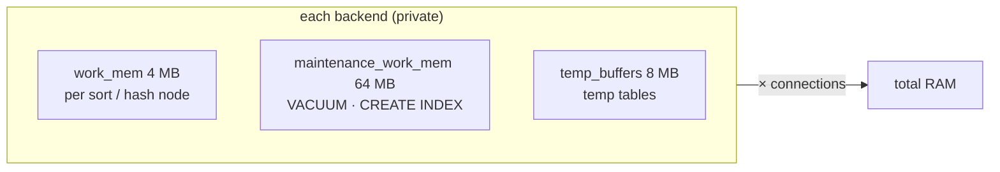
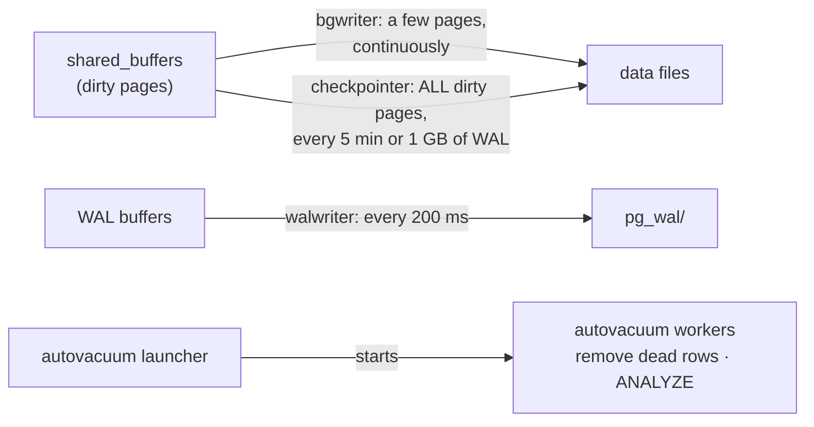
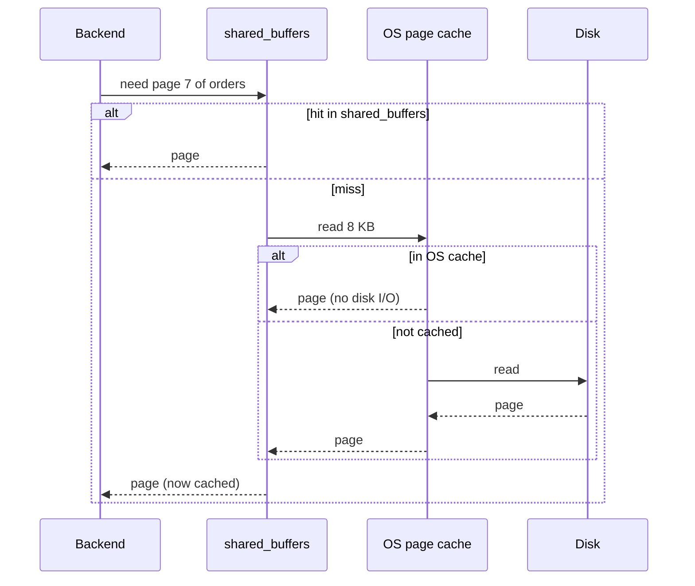
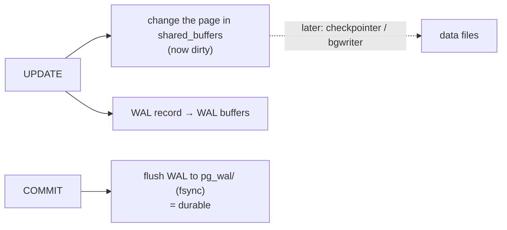
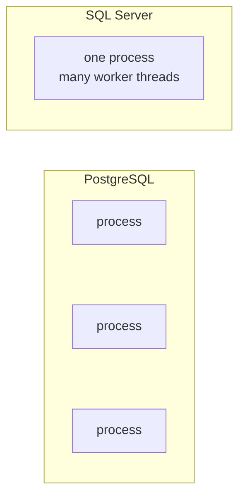

# PostgreSQL Architecture

> PostgreSQL is **a group of cooperating OS processes** that share one block of memory and one data directory. Every concept below is one piece of that picture.

## 1. The big picture



| Layer | What it is | Measured in this repo |
|---|---|---|
| Processes | separate Linux processes, not threads | 6 at idle |
| Shared memory | one region every process maps | `shared_buffers` = 128 MB |
| Disk | files under `$PGDATA` | `orders` heap = 73 MB |

## 2. postmaster — the gatekeeper

> The first process (PID 1 in the container). It never runs queries: it listens, forks, and supervises.



| Consequence | Number |
|---|---|
| Cost of a new connection | fork + auth ≈ a few ms |
| Memory per idle backend | ~5–10 MB |
| Limit | `max_connections` = 100 → use a pooler ([08-04](../08-ops-scaling/04-pgbouncer.md)) |

## 3. Backend — your session's worker

> One backend = one client connection. It parses, plans, and executes **your** SQL, using private memory plus the shared cache.


| Stage | Example error it raises | Example decision it makes |
|---|---|---|
| Parser | `syntax error at or near "FORM"` | — |
| Analyzer | `relation "order" does not exist` | `user_id` is `bigint` |
| Rewriter | — | appends `user_id = 42` from an RLS policy |
| Planner | — | Index Scan (0.36 ms) instead of Seq Scan (631 ms) |
| Executor | `division by zero` | reads pages through shared_buffers |

## 4. Shared memory — what every process sees



- A page read by backend 1 is a **cache hit** for backend 2.
- A modified slot is **dirty** until a background process writes it to disk.
- When the cache is full, the least-used slot is evicted (clock-sweep).

## 5. Per-backend memory — the part that multiplies



Worst case, concrete:

```text
100 connections × 4 MB work_mem × 2 sort/hash nodes per query = 800 MB
+ shared_buffers                                              = 128 MB
                                                              ≈ 930 MB
raise work_mem to 64 MB → the same load can need ≈ 12.9 GB
```

## 6. Background processes — the janitors

> They move data between memory and disk so your backend doesn't have to wait.



Real process list (read from `/proc` inside the container):

| PID | Process | Job | If it falls behind |
|---|---|---|---|
| 1 | postmaster | fork & supervise | — |
| 26 | checkpointer | flush all dirty pages, mark a restart point | long crash recovery, WAL piles up |
| 27 | background writer | pre-clean dirty pages | backends write pages themselves → slower queries |
| 29 | walwriter | flush WAL buffers | async commits wait longer |
| 30 | autovacuum launcher | schedule vacuum workers | table bloat ([07-03](../07-internals/03-vacuum.md)) |
| 31 | logical replication launcher | start logical replication workers | — |
| 122 | client backend | **your psql session** | — |

Started only when needed: `walsender` (a replica connects — [13](../13-replication/01-streaming-replication.md)), `archiver` (`archive_mode = on`), parallel workers, autovacuum workers.

## 7. Read path — cache hit vs miss



Measured on `orders` with `EXPLAIN (ANALYZE, BUFFERS)`: `shared hit=529 read=8817` → only 5% from shared_buffers on a cold cache → 631 ms. Same query warm: 340 ms.

## 8. Write path — in one picture


Only the WAL must reach disk at COMMIT; data files catch up later. Details: [05-crud-internals](05-crud-internals.md) · [07-02 WAL](../07-internals/02-wal.md).

## 9. On disk (`$PGDATA`)

```text
base/16384/16665   ← one table: database oid 16384 (shop) / file node
global/            ← cluster-wide catalogs (roles, databases)
pg_wal/            ← WAL segments, 16 MB each
pg_xact/           ← commit status of every transaction (CLOG)
postgresql.conf    ← settings
pg_hba.conf        ← who may connect, from where, how
```

## 10. vs SQL Server



| | PostgreSQL | SQL Server |
|---|---|---|
| Unit per connection | OS process | worker thread |
| A crashing session | its process dies, postmaster recovers | contained inside one process |
| Thousands of connections | expensive → pooler | cheaper |

## Key Points
- postmaster forks; backends work; background processes flush
- `shared_buffers` is shared, `work_mem` multiplies
- Only WAL is written at COMMIT

Next → [04-storage-layout](04-storage-layout.md)
