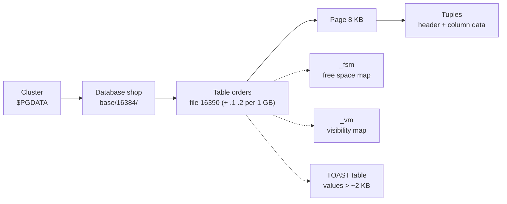

# How Data is Stored

> Cluster → database → table file → 8 KB pages → tuples (row versions).



## Inside one page


Real page after inserting 3 rows (`pageinspect`):

```sql
CREATE EXTENSION pageinspect;
CREATE TABLE demo (id int PRIMARY KEY, name text);
INSERT INTO demo VALUES (1,'a'), (2,'b'), (3,'c');

SELECT lp, lp_off, lp_len, t_xmin, t_xmax, t_ctid
FROM heap_page_items(get_raw_page('demo', 0));
--  lp | lp_off | lp_len | t_xmin | t_xmax | t_ctid
--   1 |   8160 |     30 |   2415 |      0 | (0,1)
--   2 |   8128 |     30 |   2415 |      0 | (0,2)
--   3 |   8096 |     30 |   2415 |      0 | (0,3)

SELECT lower, upper FROM page_header(get_raw_page('demo', 0));
--  36 | 8096      ← free space = 8096 − 36 bytes
```

## Tuple header fields

| Field | Meaning |
|---|---|
| `t_xmin` | transaction that **created** this version |
| `t_xmax` | transaction that **deleted/replaced** it (0 = alive) |
| `t_ctid` | address `(page, item)` of the newest version |
| null bitmap | which columns are NULL |

## Numbers — this repo

| | |
|---|---|
| Page size | 8,192 B (`block_size`) |
| File segment | 1 GB (131072 pages) |
| WAL segment | 16 MB |
| `orders`: 1M rows | 9,346 pages · 107 rows/page · 73 MB |

## Key Points
- Rows are **unordered** (heap), not clustered
- A row's address = `ctid`, changes on UPDATE
- Indexes store `key → ctid`

Deeper: [07-internals/01-storage-pages](../07-internals/01-storage-pages.md)

Next → [05-crud-internals](05-crud-internals.md)
