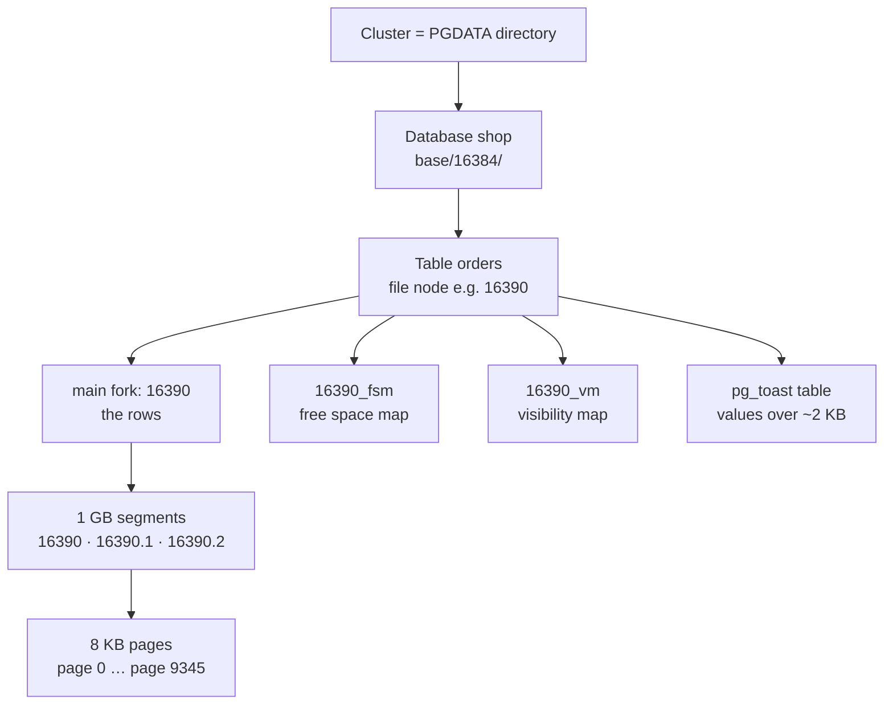
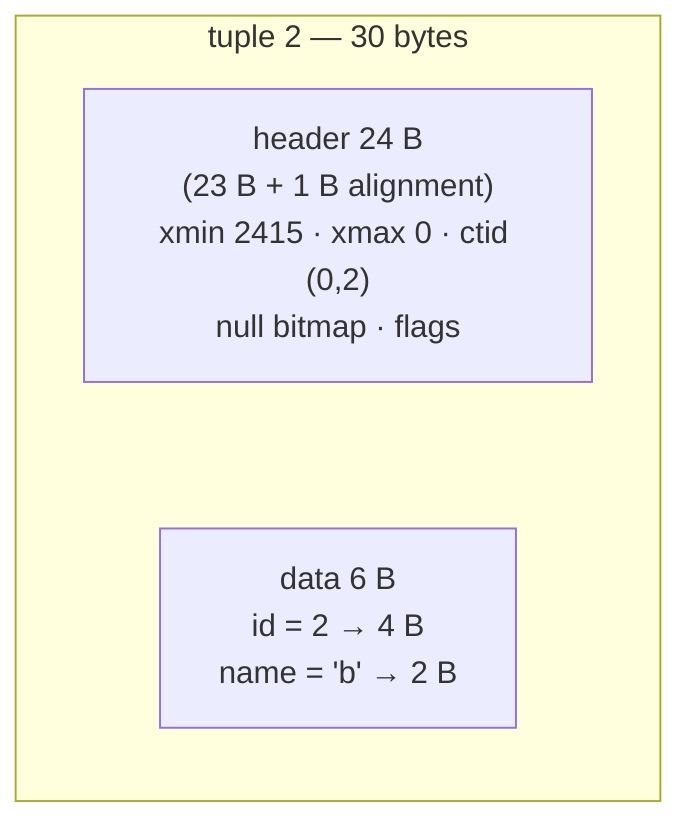

# How Data is Stored

> Cluster → database → table file → 8 KB pages → tuples (row versions).

## From cluster to page


Find the real file of any table: `SELECT pg_relation_filepath('orders');`

| File | Holds |
|---|---|
| `16390` | the rows (heap) |
| `16390_fsm` | how much free space each page has → where INSERT goes |
| `16390_vm` | which pages are all-visible → Index Only Scan, VACUUM skips them |
| TOAST table | large values, compressed, stored out of line |

## Inside one 8 KB page (measured)

After `INSERT INTO demo VALUES (1,'a'), (2,'b'), (3,'c')`:

```text
byte 0          24          36                                  8096      8128      8160      8192
     ┌───────────┬───────────┬──────────────────────────────────┬─────────┬─────────┬─────────┐
     │  header   │ lp1 lp2   │                                  │ tuple 3 │ tuple 2 │ tuple 1 │
     │  24 B     │ lp3  4 B  │          free space              │  (3,c)  │  (2,b)  │  (1,a)  │
     │           │ each  →   │                                ← │  30 B   │  30 B   │  30 B   │
     └───────────┴───────────┴──────────────────────────────────┴─────────┴─────────┴─────────┘
                             ▲ pd_lower = 36                    ▲ pd_upper = 8096
```

- **Line pointers** (lp) grow **forward** from the header: 24 + 3 × 4 = 36 = `pd_lower`.
- **Tuples** grow **backward** from the end: 8192 − 3 × 32 = 8096 = `pd_upper` (30 B each, padded to 32).
- The page is full when `pd_lower` meets `pd_upper`.
- A row's address `ctid = (page, line pointer)`: `(0,2)` = page 0, lp 2 → offset 8128.

The same numbers from `pageinspect`:

```sql
CREATE EXTENSION pageinspect;
CREATE TABLE demo (id int PRIMARY KEY, name text);
INSERT INTO demo VALUES (1,'a'), (2,'b'), (3,'c');

SELECT lp, lp_off, lp_len, t_xmin, t_xmax, t_ctid
FROM heap_page_items(get_raw_page('demo', 0));
--  lp | lp_off | lp_len | t_xmin | t_xmax | t_ctid
--   1 |   8160 |     30 |   2415 |      0 | (0,1)
--   2 |   8128 |     30 |   2415 |      0 | (0,2)
--   3 |   8096 |     30 |   2415 |      0 | (0,3)

SELECT lower, upper, pagesize FROM page_header(get_raw_page('demo', 0));
--  36 | 8096 | 8192
```

## Inside one tuple



| Header field | Meaning |
|---|---|
| `t_xmin` | transaction that **created** this version |
| `t_xmax` | transaction that **deleted/replaced** it (0 = alive) |
| `t_ctid` | address of the newest version of this row |
| null bitmap | which columns are NULL |

## Numbers — this repo (measured)

| | |
|---|---|
| Page size | 8,192 B (`block_size`) |
| File segment | 1 GB (131,072 pages) |
| WAL segment | 16 MB |
| `orders`: 1M rows | 9,346 pages · 107 rows/page · 73 MB |

## Key Points
- Rows are **unordered** (heap), not clustered by PK
- `ctid` changes on UPDATE — never store it
- Indexes store `key → ctid`

Deeper: [07-internals/01-storage-pages](../07-internals/01-storage-pages.md)

Next → [05-crud-internals](05-crud-internals.md)
