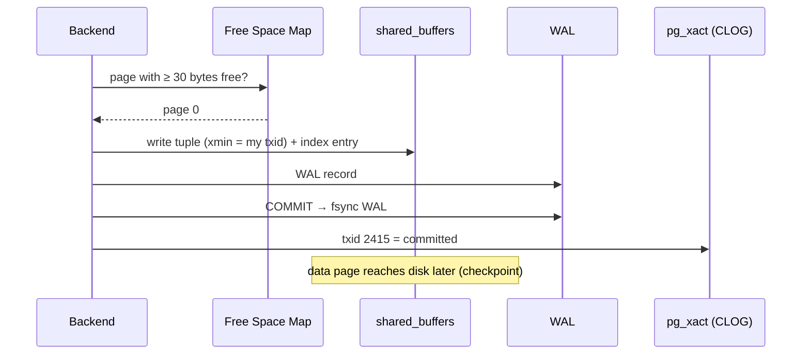
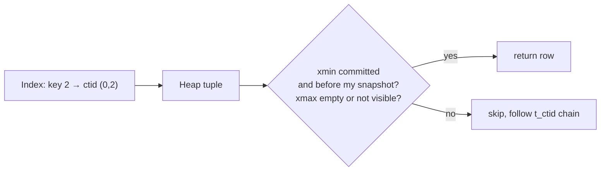

# How INSERT · SELECT · UPDATE · DELETE Work

> Postgres **never overwrites** a row: INSERT adds a version, UPDATE adds a new one, DELETE only marks the old one. VACUUM cleans up later.

## INSERT



## SELECT — visibility check



## UPDATE & DELETE — real output

```sql
UPDATE demo SET name = 'B' WHERE id = 2;     -- txid 2416
DELETE FROM demo WHERE id = 3;               -- txid 2417

SELECT lp, t_xmin, t_xmax, t_ctid FROM heap_page_items(get_raw_page('demo', 0));
--  lp | t_xmin | t_xmax | t_ctid
--   1 |   2415 |      0 | (0,1)   ← untouched
--   2 |   2415 |   2416 | (0,4)   ← old 'b': dead, points to new version
--   3 |   2415 |   2417 | (0,3)   ← deleted: only xmax set
--   4 |   2416 |      0 | (0,4)   ← new 'B'

SELECT ctid, * FROM demo;      -- (0,1) a · (0,4) B      (3 is invisible)
```

| Command | Physically |
|---|---|
| INSERT | new tuple, `xmin = txid` |
| UPDATE | old tuple `xmax = txid` + **new tuple** (whole row copied) |
| DELETE | old tuple `xmax = txid` — nothing removed |
| ROLLBACK | nothing undone; CLOG says "aborted" → versions invisible |

## VACUUM — reclaim

```sql
VACUUM demo;
SELECT lp, lp_flags, t_ctid FROM heap_page_items(get_raw_page('demo', 0));
--  1 | 1 normal   | (0,1)
--  2 | 2 redirect |          ← HOT: index still says (0,2) → jumps to 4
--  3 | 0 unused   |          ← space reusable
--  4 | 1 normal   | (0,4)
```

**HOT update** (Heap-Only Tuple): new version on the **same page** and no indexed column changed → no new index entry. Index `demo_pkey` still has only `(0,1)` and `(0,2)`.

## Key Points
- UPDATE = DELETE + INSERT internally
- ROLLBACK is instant (no undo log)
- Dead tuples = bloat until VACUUM
- Leave free space → more HOT updates (`fillfactor`)

Deeper: [06-transactions-mvcc/03-mvcc](../06-transactions-mvcc/03-mvcc.md) · [07-internals/03-vacuum](../07-internals/03-vacuum.md)

Next → [01-setup/01-docker-setup](../01-setup/01-docker-setup.md)
