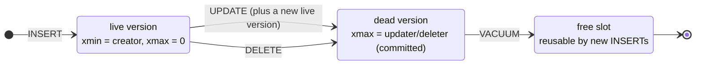
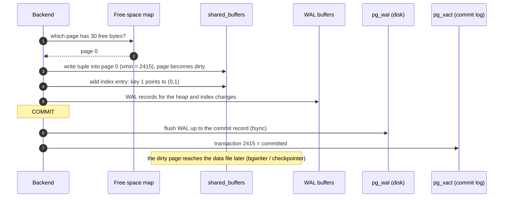
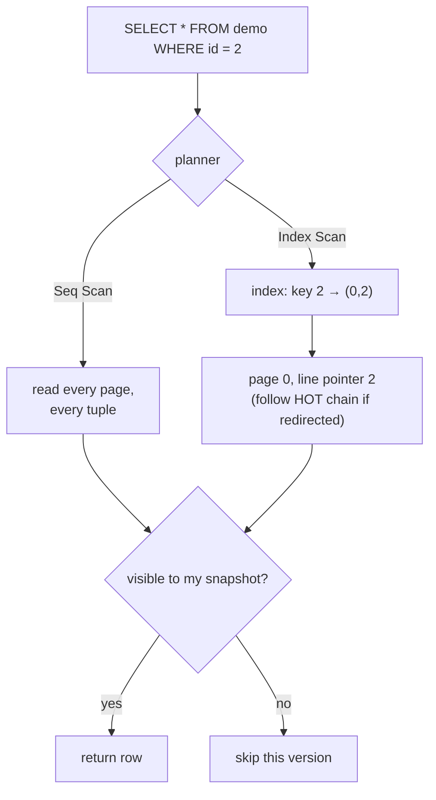
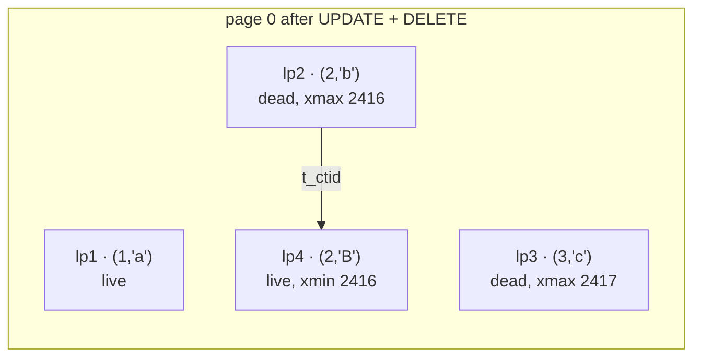
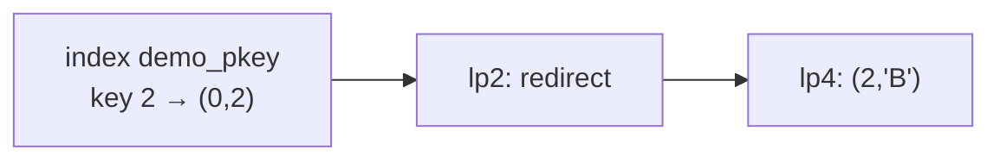

# How INSERT · SELECT · UPDATE · DELETE Work

> Postgres **never overwrites a row in place**. INSERT adds a version, UPDATE adds a new version and retires the old one, DELETE only retires. VACUUM reclaims later.

## Life of one row



## INSERT



Steps 1–5 are memory only; step 6 is the one disk write COMMIT waits for.

## SELECT — find the row, then check visibility



| A version is visible if | Checked via |
|---|---|
| `xmin` committed **and** started before my snapshot | `pg_xact` + snapshot |
| `xmax` is 0, **or** aborted, **or** after my snapshot | `pg_xact` + snapshot |

The first reader stores the commit result in the tuple (**hint bits**), so later readers skip `pg_xact` — that's why a plain `SELECT` can dirty pages.

## UPDATE and DELETE (measured)

```sql
UPDATE demo SET name = 'B' WHERE id = 2;     -- transaction 2416
DELETE FROM demo WHERE id = 3;               -- transaction 2417

SELECT lp, t_xmin, t_xmax, t_ctid FROM heap_page_items(get_raw_page('demo', 0));
--  lp | t_xmin | t_xmax | t_ctid
--   1 |   2415 |      0 | (0,1)   ← untouched
--   2 |   2415 |   2416 | (0,4)   ← old 'b': retired, points to the new version
--   3 |   2415 |   2417 | (0,3)   ← deleted: only xmax was set
--   4 |   2416 |      0 | (0,4)   ← new 'B'

SELECT ctid, * FROM demo;      -- (0,1) a · (0,4) B      (row 3 is invisible)
```



| Command | What physically happens |
|---|---|
| INSERT | new tuple, `xmin = my transaction` |
| UPDATE | old tuple gets `xmax`; a **full new copy** of the row is written |
| DELETE | old tuple gets `xmax`; nothing is removed |
| ROLLBACK | nothing undone — `pg_xact` says "aborted", so those versions are simply invisible |

## VACUUM and HOT (measured)

```sql
VACUUM demo;
SELECT lp, lp_flags, t_ctid FROM heap_page_items(get_raw_page('demo', 0));
--  1 | 1 normal   | (0,1)
--  2 | 2 redirect |          ← kept as a pointer: index still says (0,2)
--  3 | 0 unused   |          ← space free for new rows
--  4 | 1 normal   | (0,4)
```



**HOT update** (Heap-Only Tuple): when the new version fits on the **same page** and no indexed column changed, no new index entry is written — the index keeps pointing to lp2, which redirects to lp4. Index `demo_pkey` still has only 2 entries: `(0,1)` and `(0,2)`.

## Key Points
- UPDATE = retire old + write new
- ROLLBACK is instant (no undo log)
- Dead tuples = bloat until VACUUM
- Free space on the page (`fillfactor`) → more HOT updates

Deeper: [06-transactions-mvcc/03-mvcc](../06-transactions-mvcc/03-mvcc.md) · [07-internals/03-vacuum](../07-internals/03-vacuum.md)

Next → [01-setup/01-docker-setup](../01-setup/01-docker-setup.md)
