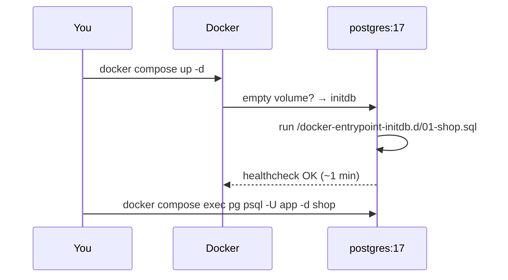

# Docker Setup

> PostgreSQL 17 in one container with a ready dataset — nothing installed on your machine.



## Example

```bash
cp .env.example .env
docker compose up -d
docker compose logs -f pg            # wait for "database system is ready"
docker compose exec pg psql -U app -d shop -c "SELECT count(*) FROM orders;"
#   count
# ---------
#  1000000
```

Optional GUI:
```bash
docker compose --profile gui up -d   # http://localhost:5050
# Add server → host: pg · user: app · password from .env
```

## Commands

| Goal | Command |
|---|---|
| Stop | `docker compose stop` |
| Start | `docker compose start` |
| Reset data | `docker compose down -v && docker compose up -d` |
| Shell | `docker compose exec pg bash` |
| Run a lab | `\i /repo/labs/02-sql-basics.sql` (inside psql) |

## Key Points
- Init scripts run **only on first start**
- Data lives in volume `pg_data`
- Port bound to `127.0.0.1` only

## Pitfalls
❌ Edited `shop.sql`, nothing changed → ✅ `docker compose down -v` (old volume)

❌ `port is already allocated` → ✅ set `PG_PORT=15432` in `.env`

❌ Git Bash: `psql -f /repo/x.sql` → `No such file` → ✅ `export MSYS_NO_PATHCONV=1`

Next → [02-psql-cheatsheet](02-psql-cheatsheet.md)
