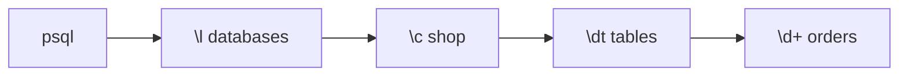

# psql Cheatsheet

> `psql` is the official CLI. Commands starting with `\` are meta-commands, not SQL.



## Meta-commands

| Command | Does |
|---|---|
| `\l` | list databases |
| `\c shop` | connect to a database |
| `\dt` | list tables |
| `\d+ orders` | columns + indexes + size |
| `\di` | list indexes |
| `\df` | list functions |
| `\dx` | installed extensions |
| `\x auto` | vertical output for wide rows |
| `\timing on` | show time per query |
| `\i file.sql` | run a file |
| `\e` | edit last query in an editor |
| `\q` | quit |

## Example

```sql
\timing on
\d orders
--   Column   |           Type           | Nullable
-- -----------+--------------------------+----------
--  id        | bigint                   | not null
--  user_id   | bigint                   | not null
--  ...
SELECT count(*) FROM users;
-- Time: 4.812 ms
```

## Key Points
- `\?` = all meta-commands
- `\h CREATE INDEX` = SQL syntax help
- Every SQL statement ends with `;`

Next → [02-sql-basics/01-select-where](../02-sql-basics/01-select-where.md)
